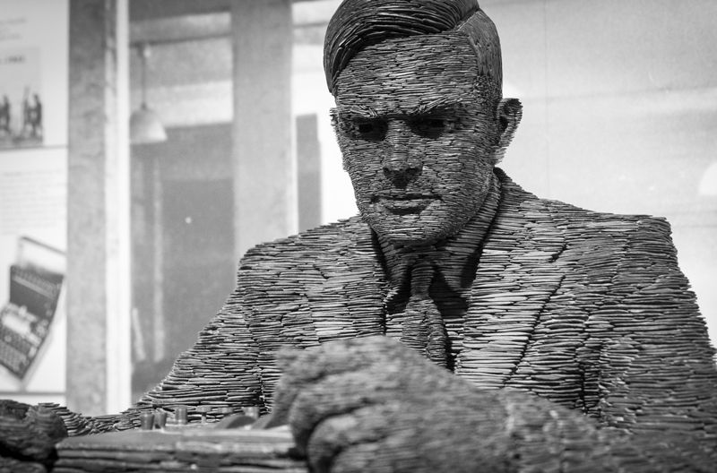
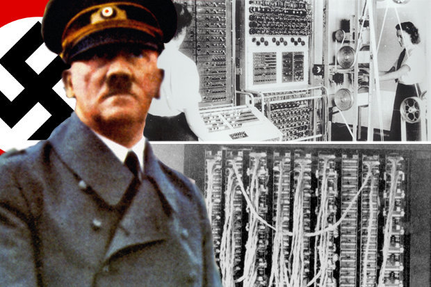

&nbsp;

<h1>Alan Turing</h1>

BRITISH MATHEMATICIAN AND LOGICIAN

&nbsp;

<strong>Born:</strong>&nbsp;

&nbsp;23 June 1912 Maida Vale, London, England

 <strong>Died</strong>&nbsp;:

&nbsp;7 June 1954 (aged 41) Wilmslow, Cheshire, England

 <strong>Cause of death:&nbsp;</strong>

&nbsp;Cyanide poisoning

 <strong>Resting place:&nbsp;</strong>

&nbsp;Ashes scattered near Woking Crematorium

 <strong>Residence:</strong>

&nbsp;Wilmslow, Cheshire, England

 <strong>Education:</strong>

King's College, Cambridge (BA, MA) Princeton University (PhD)

 <strong>Known for:</strong>

Cryptanalysis of the Enigma Turing's proof Turing machine Turing test Unorganised machine LU decomposition

 <strong>Awards:</strong>

Smith's Prize (1936)

&nbsp;

<strong>Scientific career:</strong>

 <strong>Fields</strong>

Logic Mathematics Cryptanalysis Computer science Mathematical and theoretical biology

 <strong>Institutions:</strong>

University of Manchester Government Code and Cypher School National Physical Laboratory

 <strong>Thesis:</strong>

&nbsp;Systems of Logic Based on Ordinals (1938)

 <strong>Doctoral advisor:</strong>

&nbsp;Alonzo Church

 <strong>Doctoral students:</strong>

&nbsp;Robin Gandy

 <strong>Influences:</strong>

&nbsp;Max Newman

&nbsp;

<strong>Signature:</strong>

&nbsp;

<strong>Further reading </strong>

1.  Computing Machinery and Intelligence By Alan Turing 
              
      <a href="https://github.com/manjunath5496/Alan-Turing-Digital-Archive/blob/master/t1.pdf" target="_blank" style="text-decoration:none">  
 Download
 </a> 

2.  Systems of Logic Based on Ordinals By Alan Turing  <a href="https://github.com/manjunath5496/Alan-Turing-Digital-Archive/blob/master/t2.pdf" target="_blank" style="text-decoration:none">  
 Download
 </a> 

3.  The Applications of Probability to Cryptography By Alan Turing  <a href="https://github.com/manjunath5496/Alan-Turing-Digital-Archive/blob/master/t3.pdf" target="_blank" style="text-decoration:none">  
 Download
 </a> 

4.  Turing's Treatise on the Enigma By Alan Turing  <a href="https://drive.google.com/file/d/1Q7zmJ2kAkvvvnzRCnjnZx3wBdRO3Rp6A/view?usp=sharing" target="_blank" style="text-decoration:none">  
 Download
 </a> 

5.  The Annotated Turing: A Guided Tour Through Alan Turing's Historic Paper on Computability and the Turing Machine By 
Charles Petzold  <a href="https://github.com/manjunath5496/Alan-Turing-Digital-Archive/blob/master/t5.pdf" target="_blank" style="text-decoration:none">  
 Download
 </a> 

6.  Turing, Father of the Modern Computer By B. Jack Copeland   <a href="https://github.com/manjunath5496/Alan-Turing-Digital-Archive/blob/master/t6.pdf" target="_blank" style="text-decoration:none">  
 Download
 </a> 

7.  Alan Turing's Automatic Computing Engine By B. Jack Copeland   <a href="https://github.com/manjunath5496/Alan-Turing-Digital-Archive/blob/master/t7.pdf" target="_blank" style="text-decoration:none">  
 Download
 </a> 

8.  Alan Turing By Geoff Wilkins   <a href="https://github.com/manjunath5496/Alan-Turing-Digital-Archive/blob/master/t8.pdf" target="_blank" style="text-decoration:none">  
 Download
 </a> 

9.  Turing Arts Symposium  By Cate Dowd   <a href="https://github.com/manjunath5496/Alan-Turing-Digital-Archive/blob/master/t9.pdf" target="_blank" style="text-decoration:none">  
 Download
 </a> 

10.  A Bibliography of Publications of Alan Mathison Turing By Nelson H. F. Beebe   <a href="https://github.com/manjunath5496/Alan-Turing-Digital-Archive/blob/master/t10.pdf" target="_blank" style="text-decoration:none">  
 Download
 </a> 

11.  Alan Turing: His Work and Impact By Jan van Leeuwen   <a href="https://drive.google.com/file/d/1hOlmAej0yrFql7-3hS28EgvtKKDg2DLf/view?usp=sharing" target="_blank" style="text-decoration:none">  
 Download
 </a> 

12.  The Essential Turing By B. Jack Copeland   <a href="https://github.com/manjunath5496/Alan-Turing-Digital-Archive/blob/master/t12.pdf" target="_blank" style="text-decoration:none">  
 Download
 </a> 

13.  Mathematics in the Age of the Turing Machine By Thomas C. Hales   <a href="https://github.com/manjunath5496/Alan-Turing-Digital-Archive/blob/master/t13.pdf" target="_blank" style="text-decoration:none">  
 Download
 </a> 

14.  Letter to Alan Turing By Giuseppe Longo   <a href="https://github.com/manjunath5496/Alan-Turing-Digital-Archive/blob/master/t14.pdf" target="_blank" style="text-decoration:none">  
 Download
 </a> 

15.  The Legacy of Turing in Numerical Analysis By Felipe Cucker   <a href="https://github.com/manjunath5496/Alan-Turing-Digital-Archive/blob/master/t15.pdf" target="_blank" style="text-decoration:none">  
 Download
 </a> 

16.  The Turing Test   <a href="https://github.com/manjunath5496/Alan-Turing-Digital-Archive/blob/master/t16.pdf" target="_blank" style="text-decoration:none">  
 Download
 </a> 

17.  Alan Turing: The Hidden Wartime Manuscript By the Father of Computing   <a href="https://github.com/manjunath5496/Alan-Turing-Digital-Archive/blob/master/t17.pdf" target="_blank" style="text-decoration:none">  
 Download
 </a> 

18.  Alan Turing and the Origins of Modern Gaussian Elimination By Froil&#225;n M. Dopico   <a href="https://github.com/manjunath5496/Alan-Turing-Digital-Archive/blob/master/t18.pdf" target="_blank" style="text-decoration:none">  
 Download
 </a> 

19.  Alan Turing and the Turing Award Winners By Luis Lamb   <a href="https://github.com/manjunath5496/Alan-Turing-Digital-Archive/blob/master/t19.pdf" target="_blank" style="text-decoration:none">  
 Download
 </a> 

20.  The Life and Intelligence of Alan Turing By Denbigh Starkey   <a href="https://github.com/manjunath5496/Alan-Turing-Digital-Archive/blob/master/t20.pdf" target="_blank" style="text-decoration:none">  
 Download
 </a> 

21.  The Incomputable Alan Turing By S. Barry Cooper   <a href="https://github.com/manjunath5496/Alan-Turing-Digital-Archive/blob/master/t21.pdf" target="_blank" style="text-decoration:none">  
 Download
 </a> 

22.  Alan Turing, Enigma, and the Breaking of German Machine Ciphers in World War II By Lee A. Gladwin   <a href="https://github.com/manjunath5496/Alan-Turing-Digital-Archive/blob/master/t22.pdf" target="_blank" style="text-decoration:none">  
 Download
 </a> 

23.  Alan Turing's Forgotten Ideas in Computer Science By Diane Proudfoot   <a href="https://github.com/manjunath5496/Alan-Turing-Digital-Archive/blob/master/t23.pdf" target="_blank" style="text-decoration:none">  
 Download
 </a> 

24.  Alan Turing "Founder of Computer Science" By Prof. Jonathan P. Bowen   <a href="https://github.com/manjunath5496/Alan-Turing-Digital-Archive/blob/master/t24.pdf" target="_blank" style="text-decoration:none">  
 Download
 </a> 

25. The Ghost in the Quantum Turing Machine By Scott Aaronson   <a href="https://github.com/manjunath5496/Alan-Turing-Digital-Archive/blob/master/t25.pdf" target="_blank" style="text-decoration:none">  
 Download
 </a> 

26. The Turing Test: Then and Now By Peter Hawke   <a href="https://github.com/manjunath5496/Alan-Turing-Digital-Archive/blob/master/t26.pdf" target="_blank" style="text-decoration:none">  
 Download
 </a> 

27. Turing-Post Relativized Computability and Interactive Computing By Robert Irving Soare   <a href="https://github.com/manjunath5496/Alan-Turing-Digital-Archive/blob/master/t27.pdf" target="_blank" style="text-decoration:none">  
 Download
 </a> 

28. Alan Turing, Computing, Bletchley, and Mathematics By Rod Downey   <a href="https://github.com/manjunath5496/Alan-Turing-Digital-Archive/blob/master/t28.pdf" target="_blank" style="text-decoration:none">  
 Download
 </a> 

29. AM Turing's ACE Report of 1946 and other papers   <a href="https://github.com/manjunath5496/Alan-Turing-Digital-Archive/blob/master/t29.pdf" target="_blank" style="text-decoration:none">  
 Download
 </a> 

30. Alan Turing and the Decision Problem By Richard Zach  <a href="https://github.com/manjunath5496/Alan-Turing-Digital-Archive/blob/master/t30.pdf" target="_blank" style="text-decoration:none">  
 Download
 </a> 

31. On Computable Numbers, with an Application to the Entscheidungsproblem By Alan Turing  <a href="https://github.com/manjunath5496/Alan-Turing-Digital-Archive/blob/master/t31.pdf" target="_blank" style="text-decoration:none">  
 Download
 </a> 

32. La Machine de Turing   <a href="https://github.com/manjunath5496/Alan-Turing-Digital-Archive/blob/master/t32.pdf" target="_blank" style="text-decoration:none">  
 Download
 </a> 

33. The Chemical Basis of Morphogenesis By Alan Turing   <a href="https://github.com/manjunath5496/Alan-Turing-Digital-Archive/blob/master/t33.pdf" target="_blank" style="text-decoration:none">  
 Download
 </a> 

34. Turing's Mathematical Work By P.D. Welch   <a href="https://github.com/manjunath5496/Alan-Turing-Digital-Archive/blob/master/t34.pdf" target="_blank" style="text-decoration:none">  
 Download
 </a> 

35. Intelligent Machinery A Heretical Theory; reprinted in (Copeland 2004)   <a href="https://github.com/manjunath5496/Alan-Turing-Digital-Archive/blob/master/t35.pdf" target="_blank" style="text-decoration:none">  
 Download
 </a> 

36. RO Gandy An Early Proof of Normalization By Alan Turing  <a href="https://github.com/manjunath5496/Alan-Turing-Digital-Archive/blob/master/t36.pdf" target="_blank" style="text-decoration:none">  
 Download
 </a> 

37. An Early Program Proof By Alan Turing  <a href="https://github.com/manjunath5496/Alan-Turing-Digital-Archive/blob/master/t37.pdf" target="_blank" style="text-decoration:none">  
 Download
 </a> 

38. On Alan Turing and the Origins of Digital Computers By B. Randell  <a href="https://github.com/manjunath5496/Alan-Turing-Digital-Archive/blob/master/t38.pdf" target="_blank" style="text-decoration:none">  
 Download
 </a> 

39. The Genius of Alan Turing: The Computing Classical Model By Luís Homem  <a href="https://github.com/manjunath5496/Alan-Turing-Digital-Archive/blob/master/t39.pdf" target="_blank" style="text-decoration:none">  
 Download
 </a> 

40. Alan Turing and the Other Theory of Computation (expanded) By Lenore Blum  <a href="https://github.com/manjunath5496/Alan-Turing-Digital-Archive/blob/master/t40.pdf" target="_blank" style="text-decoration:none">  
 Download
 </a> 

41. Alan Turing's Chemical Theory of Phyllotaxis By M.D. Rueda-Contreras  <a href="https://github.com/manjunath5496/Alan-Turing-Digital-Archive/blob/master/t41.pdf" target="_blank" style="text-decoration:none">  
 Download
 </a> 

42. ACM Turing Award Lectures: The First Twenty Years (1966 &minus; 1985)  <a href="https://github.com/manjunath5496/Alan-Turing-Digital-Archive/blob/master/t42.pdf" target="_blank" style="text-decoration:none">  
 Download
 </a> 

43. Mathematical Logic By Alan Turing  <a href="https://github.com/manjunath5496/Alan-Turing-Digital-Archive/blob/master/t43.pdf" target="_blank" style="text-decoration:none">  
 Download
 </a> 

44. Parsing the Turing Test By Gary Roberts  <a href="https://github.com/manjunath5496/Alan-Turing-Digital-Archive/blob/master/t44.pdf" target="_blank" style="text-decoration:none">  
 Download
 </a> 

45. Thinking about Godel and Turing: Essays on Complexity, 1970 &minus; 2007  <a href="https://github.com/manjunath5496/Alan-Turing-Digital-Archive/blob/master/t45.pdf" target="_blank" style="text-decoration:none">  
 Download
 </a> 

46. Turing (A Novel about Computation) By Christos Papadimitriou  <a href="https://github.com/manjunath5496/Alan-Turing-Digital-Archive/blob/master/t46.pdf" target="_blank" style="text-decoration:none">  
 Download
 </a> 

47. Turing Option By Harry Harrison  <a href="https://github.com/manjunath5496/Alan-Turing-Digital-Archive/blob/master/t47.pdf" target="_blank" style="text-decoration:none">  
 Download
 </a> 

48. Alan Turing: The Logical and Physical Basis of Computing By Andrew Hodges  <a href="https://github.com/manjunath5496/Alan-Turing-Digital-Archive/blob/master/t48.pdf" target="_blank" style="text-decoration:none">  
 Download
 </a> 

49. The History of Artificial Intelligence  <a href="https://github.com/manjunath5496/Alan-Turing-Digital-Archive/blob/master/t49.pdf" target="_blank" style="text-decoration:none">  
 Download
 </a> 

50. Mind, Computing Machinery and Intelligence By A.M.Turing  <a href="https://github.com/manjunath5496/Alan-Turing-Digital-Archive/blob/master/t50.pdf" target="_blank" style="text-decoration:none">  
 Download
 </a> 

51. Alan Turing and Number Theory  <a href="https://github.com/manjunath5496/Alan-Turing-Digital-Archive/blob/master/t51.pdf" target="_blank" style="text-decoration:none">  
 Download
 </a> 

52. Alan Turing: The Enigma By Andrew Hodges   <a href="https://github.com/manjunath5496/Alan-Turing-Digital-Archive/blob/master/t52.pdf" target="_blank" style="text-decoration:none">  
 Download
 </a> 

53. A Madman Dreams of Turing Machines By Janna Levin   <a href="https://github.com/manjunath5496/Alan-Turing-Digital-Archive/blob/master/t53.pdf" target="_blank" style="text-decoration:none">  
 Download
 </a> 

54. Computing Over The Reals Where Turing Meets Newton   <a href="https://github.com/manjunath5496/Alan-Turing-Digital-Archive/blob/master/t54.pdf" target="_blank" style="text-decoration:none">  
 Download
 </a> 

55. Die Turing Option By Marvin Minsky  <a href="https://github.com/manjunath5496/Alan-Turing-Digital-Archive/blob/master/t55.pdf" target="_blank" style="text-decoration:none">  
 Download
 </a> 

56. Hypercomputation: Computing Beyond the Church &minus; Turing Barrier  <a href="https://github.com/manjunath5496/Alan-Turing-Digital-Archive/blob/master/t56.pdf" target="_blank" style="text-decoration:none">  
 Download
 </a> 

57. The Turing Test (Doctor Who Series)   <a href="https://github.com/manjunath5496/Alan-Turing-Digital-Archive/blob/master/t57.pdf" target="_blank" style="text-decoration:none">  
 Download
 </a> 

58. Thinking On The Web: Berners-Lee, Godel And Turing   <a href="https://github.com/manjunath5496/Alan-Turing-Digital-Archive/blob/master/t58.pdf" target="_blank" style="text-decoration:none">  
 Download
 </a> 

59. Alan Turing and the Development of Artificial Intelligence   <a href="https://github.com/manjunath5496/Alan-Turing-Digital-Archive/blob/master/t59.pdf" target="_blank" style="text-decoration:none">  
 Download
 </a> 

60. Alan Turing Archive   <a href="https://github.com/manjunath5496/Alan-Turing-Digital-Archive/blob/master/t60.pdf" target="_blank" style="text-decoration:none">  
 Download
 </a> 

61. Can Digital Computers Think? By Alan Turing    <a href="https://github.com/manjunath5496/Alan-Turing-Digital-Archive/blob/master/t61.pdf" target="_blank" style="text-decoration:none">  
 Download
 </a> 

62. Turing Machines, Computers, And Artificial Intelligence By Peter R. Krebs    <a href="https://github.com/manjunath5496/Alan-Turing-Digital-Archive/blob/master/t62.pdf" target="_blank" style="text-decoration:none">  
 Download
 </a> 

63. Turing Machines with Sublogarithmic Space By Andrzej Szepietowski    <a href="https://github.com/manjunath5496/Alan-Turing-Digital-Archive/blob/master/t63.pdf" target="_blank" style="text-decoration:none">  
 Download
 </a> 

64. The Automatic Computing Machine By Alan Turing   <a href="https://github.com/manjunath5496/Alan-Turing-Digital-Archive/blob/master/t64.pdf" target="_blank" style="text-decoration:none">  
 Download
 </a> 

65. The Imitation Game By Graham Moore   <a href="https://github.com/manjunath5496/Alan-Turing-Digital-Archive/blob/master/t65.pdf" target="_blank" style="text-decoration:none">  
 Download
 </a> 

66. Breaking Enigma By Jeremy Wright   <a href="https://github.com/manjunath5496/Alan-Turing-Digital-Archive/blob/master/t66.pdf" target="_blank" style="text-decoration:none">  
 Download
 </a> 

67. Breaking Enigma and the U-boat Codes and the Legacy of Alan Turing   <a href="https://github.com/manjunath5496/Alan-Turing-Digital-Archive/blob/master/t67.pdf" target="_blank" style="text-decoration:none">  
 Download
 </a> 

68. Alan Turing and Enigmatic Statistics By S. Barry Cooper   <a href="https://github.com/manjunath5496/Alan-Turing-Digital-Archive/blob/master/t68.pdf" target="_blank" style="text-decoration:none">  
 Download
 </a> 

69. Letter to Norman Routledge By Alan Turing   <a href="https://github.com/manjunath5496/Alan-Turing-Digital-Archive/blob/master/t69.pdf" target="_blank" style="text-decoration:none">  
 Download
 </a> 

70. Maths from the talk: "Alan Turing and the Enigma Machine"   <a href="https://github.com/manjunath5496/Alan-Turing-Digital-Archive/blob/master/t70.pdf" target="_blank" style="text-decoration:none">  
 Download
 </a> 

71. The Genius Who Gave Us The Future: 100 years of Alan Turing   <a href="https://github.com/manjunath5496/Alan-Turing-Digital-Archive/blob/master/t71.pdf" target="_blank" style="text-decoration:none">  
 Download
 </a> 

72. Turing and the Computer By Diane Proudfoot  <a href="https://github.com/manjunath5496/Alan-Turing-Digital-Archive/blob/master/t72.pdf" target="_blank" style="text-decoration:none">  
 Download
 </a> 

73. Alan Turing at Bletchley Park in World War II By Tony Sale  <a href="https://github.com/manjunath5496/Alan-Turing-Digital-Archive/blob/master/t73.pdf" target="_blank" style="text-decoration:none">  
 Download
 </a> 

74. Alan Turing: Life and Legacy of a Great Thinker By D Hofstadter  <a href="https://github.com/manjunath5496/Alan-Turing-Digital-Archive/blob/master/t74.pdf" target="_blank" style="text-decoration:none">  
 Download
 </a> 

75. The Enigma Machine By Eric Roberts  <a href="https://github.com/manjunath5496/Alan-Turing-Digital-Archive/blob/master/t75.pdf" target="_blank" style="text-decoration:none">  
 Download
 </a> 

76. The Military Use of Alan Turing By Andrew Hodges  <a href="https://github.com/manjunath5496/Alan-Turing-Digital-Archive/blob/master/t76.pdf" target="_blank" style="text-decoration:none">  
 Download
 </a> 

77. Dr. Alan Turing "Father of Computer Science and Philosopher" By Paul Conn  <a href="https://github.com/manjunath5496/Alan-Turing-Digital-Archive/blob/master/t77.pdf" target="_blank" style="text-decoration:none">  
 Download
 </a> 

78. Turing and von Neumann's Brains and their Computers  <a href="https://github.com/manjunath5496/Alan-Turing-Digital-Archive/blob/master/t78.pdf" target="_blank" style="text-decoration:none">  
 Download
 </a> 

79. Cryptography and Alan Turing  <a href="https://github.com/manjunath5496/Alan-Turing-Digital-Archive/blob/master/t79.pdf" target="_blank" style="text-decoration:none">  
 Download
 </a> 

80. Undecidable problems  <a href="https://github.com/manjunath5496/Alan-Turing-Digital-Archive/blob/master/t80.pdf" target="_blank" style="text-decoration:none">  
 Download
 </a> 

81. Alan Turing: Designs first computer (Video transcript: Clip from Horizon: The Strange Life and Death of Alan Turing, produced by Christopher Sykes Productions)   <a href="https://github.com/manjunath5496/Alan-Turing-Digital-Archive/blob/master/t81.pdf" target="_blank" style="text-decoration:none">  
 Download
 </a> 

82.  Alan Turing: Convicted for gross indecency (Video transcript: Clip from Horizon: The Strange Life and Death of Dr Turing – produced by Christopher Sykes Productions)  <a href="https://github.com/manjunath5496/Alan-Turing-Digital-Archive/blob/master/t82.pdf" target="_blank" style="text-decoration:none">  
 Download
 </a> 

83.  Alan Turing: Suicide (Video transcript: Clip from Horizon: The Strange Life and Death of Dr Turing – produced by Christopher Sykes Productions)  <a href="https://github.com/manjunath5496/Alan-Turing-Digital-Archive/blob/master/t83.pdf" target="_blank" style="text-decoration:none">  
 Download
 </a> 

84.  Alan Turing: Devastated by his friend's death (Video transcript: Clip from Horizon: The Strange Life and Death of Dr Turing – produced by Christopher Sykes Productions)  <a href="https://github.com/manjunath5496/Alan-Turing-Digital-Archive/blob/master/t84.pdf" target="_blank" style="text-decoration:none">  
 Download
 </a> 

85.  Universal Turing machine: a design for a multi-purpose computer (Video transcript: clip from Order and Disorder, Episode 2, first broadcast on BBC Four on 23 Oct 2012)   <a href="https://github.com/manjunath5496/Alan-Turing-Digital-Archive/blob/master/t85.pdf" target="_blank" style="text-decoration:none">  
 Download
 </a> 

86. Turing's Test and Believable AI in Games  <a href="https://github.com/manjunath5496/Alan-Turing-Digital-Archive/blob/master/t86.pdf" target="_blank" style="text-decoration:none">  
 Download
 </a>
 

87. What Kind of Turing Test Did Turing Have in Mind? By Jean Lass&#232;gue  <a href="https://github.com/manjunath5496/Alan-Turing-Digital-Archive/blob/master/t87.pdf" target="_blank" style="text-decoration:none">  
 Download
 </a>
 

88. Historical Reflections Actually, Turing Did Not Invent the Computer  <a href="https://github.com/manjunath5496/Alan-Turing-Digital-Archive/blob/master/t88.pdf" target="_blank" style="text-decoration:none">  
 Download
 </a>
 

89. Turing's Theory of Morphogenesis: Where We Started, Where We Are and Where We Want to Go  <a href="https://github.com/manjunath5496/Alan-Turing-Digital-Archive/blob/master/t89.pdf" target="_blank" style="text-decoration:none">  
 Download
 </a>
 

90. Alan Turing &minus; Einstein of Computer Science   <a href="https://github.com/manjunath5496/Alan-Turing-Digital-Archive/blob/master/t90.pdf" target="_blank" style="text-decoration:none">  
 Download
 </a>
 

91. Educating a Mathematical Genius: Alan Turing at Sherborne School  <a href="https://github.com/manjunath5496/Alan-Turing-Digital-Archive/blob/master/t91.pdf" target="_blank" style="text-decoration:none">  
 Download
 </a>
 

92. After 1952: The later development of Alan Turing's ideas on the mathematics of pattern formation  <a href="https://github.com/manjunath5496/Alan-Turing-Digital-Archive/blob/master/t92.pdf" target="_blank" style="text-decoration:none">  
 Download
 </a>
 

93. Alan Turing (1912&minus;1954) By Ong Marc-us  <a href="https://github.com/manjunath5496/Alan-Turing-Digital-Archive/blob/master/t93.pdf" target="_blank" style="text-decoration:none">  
 Download
 </a>
 

94. Turing's Test and conscious thought  <a href="https://github.com/manjunath5496/Alan-Turing-Digital-Archive/blob/master/t94.pdf" target="_blank" style="text-decoration:none">  
 Download
 </a>
 

&nbsp;

&nbsp;

<strong>Turing, age 5.</strong>&nbsp;

&nbsp;

<strong>Alan Turing as a boy.</strong>&nbsp;

&nbsp;

<strong>Alan and his elder brother John.</strong>&nbsp;

&nbsp;

<strong>Turing and friends on a Cornish beach, April 1930.</strong>&nbsp;

&nbsp;

<strong>Alan Turing, second from right, with (L-R) Hogg, Geoffrey OHanlon (housemaster) and White.</strong>&nbsp;

&nbsp;

<strong>Alan Turing with school friends, Robin and John Wainwright and Hugh Highet.</strong>&nbsp;

&nbsp;

<strong>Turing in a photo from his days at the Sherborne School. </strong>&nbsp;

&nbsp;

<strong>Alan Turing, aged 15, at Westcott House, Sherborne School. </strong>&nbsp;

&nbsp;

<strong>Alan Turing's report card from when he attended Sherborne School in Dorset is to go on display at the Fitzwilliam Musuem in Cambridge.</strong>&nbsp;

&nbsp;

<strong>Alan Turing's school report when he was 16-years-old.</strong>&nbsp;

&nbsp;

<strong>This is the copy of the school prize which Turing chose in honour of his 'first love' Christopher Morcom.</strong>&nbsp;

&nbsp;

<strong>Turing, age 18, next to Ben Davis, head of Mathematics at Sherborne School.  </strong>&nbsp;

&nbsp;

<strong>Young Alan Turing.</strong>&nbsp;

&nbsp;

<strong>Alan Turing aged 19, bathing on the island of Sark</strong>&nbsp;

&nbsp;

<strong>Alan Turing in his early 20s.</strong>&nbsp;

&nbsp;

<strong>Turing running. </strong>&nbsp;

&nbsp;

<strong>Turing reading.</strong>&nbsp;

&nbsp;

<strong>Turing (right) and Mermagen in their last year at Sherborne.</strong>&nbsp;

&nbsp;

<strong>Alan Turing in 1934.</strong>&nbsp;

&nbsp;

<strong>The young Alan Turing in more innocent times.</strong>&nbsp;

&nbsp;

<strong> On the right is a rare snapshot of Alan Turing in a seminar at Princeton at this period.</strong>&nbsp;

&nbsp;

<strong>Alan Turing in a boat just before the Second World War.</strong>&nbsp;

&nbsp;

<strong>Alan Turing (far left) on a bus.</strong>&nbsp;

&nbsp;

<strong>Alan Turing in a garden in Dene Road, Guildford in 1928.</strong>&nbsp;

&nbsp;

<strong>Ratio Club at Cambridge 1952, Giles Brindley (yellow), Donald MacKay (red), Alan Turing (green).</strong>&nbsp;

&nbsp;

<strong>Alan Turing (right) stands next to the Ferranti Mark I. </strong>&nbsp;

&nbsp;

<strong> Conceptualization of the Turing Machine invented by Turing in 1936.</strong>&nbsp;

&nbsp;

<strong> Mechanical Wooden Turing Machine.</strong>&nbsp;

&nbsp;

<strong>This is a Turing machine built from Legos. It's a theoretical machine Turing designed for computing in the late 30s.</strong>&nbsp;

&nbsp;

<strong>A letter which Alan Turing sent to his mother.</strong>&nbsp;

&nbsp;

<strong>Despite his death being ruled suicide, Turing's mother said it was 'quite probably' his death from cyanide poisoning was a mistake.</strong>&nbsp;

&nbsp;

<strong>Alan Turing memorial &minus; Manchester</strong>&nbsp;

&nbsp;

<strong>Turing lived the last years of his life at this home in Wilmslow, Cheshire near Manchester. He took his own life at this house on June 7, 1954.</strong>&nbsp;

&nbsp;

<strong>Turing led the Naval Enigma codebreaking efforts from this office in Hut 8. The building at Bletchley Park has been fully restored.</strong>&nbsp;

&nbsp;

<strong>Hut 8 at Bletchley Park is the building Turing worked in during the early years of World War II. Turing was instrumental in breaking the German naval Enigma code.</strong>&nbsp;

&nbsp;

<strong>In 1931, Turing began his studies at King's College, Cambridge.</strong>&nbsp;

&nbsp;

<strong>Turing's statue at Bletchley Park (made of layers of stacked slate, shown from the chest up).</strong>&nbsp;

&nbsp;

<strong>Bombe machine</strong>&nbsp;

 Bombe machine, a code-breaking machine, originally developed by Alan Turing and others, used during World War II.

&nbsp;

<strong>Turing memorial statue plaque in Sackville Park, Manchester.</strong>&nbsp;

&nbsp;

<strong>During World War II, Bletchley Park housed the UK's code breaking efforts against the Axis powers. Turing worked here.</strong>&nbsp;

&nbsp;

<strong>Turing was recruited to the National Physical Laboratory in 1945.</strong>&nbsp;

&nbsp;

<strong>Alan Turing's codebreakers decoding of the Enigma Machine helped win World War II.</strong>&nbsp;

&nbsp;

<strong>&nbsp;</strong>&nbsp;

&nbsp;

<strong>ALAN TURING: Bletchley Park will reopen as the National College of Cyber Security.</strong>&nbsp;

&nbsp;

<strong>U-BOATS: Breaking the Enigma code allowed Brit ships to evade German U-boats.</strong>&nbsp;

&nbsp;

<strong>A page from the notebook of British mathematician and pioneer in computer science Alan Turing, displayed in front of his portrait during an auction preview in Hong Kong.</strong>&nbsp;

&nbsp;

<strong>Cassandra Hatton, senior specialist in fine books and manuscripts and director of the history of science from Bonhams auction house, shows a notebook of British mathematician and pioneer in computer science Alan Turing, during an auction preview in Hong Kong.</strong>&nbsp;

&nbsp;

<strong>The DEUCE: Digital Electronic Universal Computing Engine, was the first commercially produced digital model and was developed from earlier plans by Alan Turing.</strong>&nbsp;

&nbsp;

<strong>  A rare manuscript belonging to British mathematician and code breaker Alan Turing  displayed in Hong Kong on March 19, 2015.</strong>&nbsp;

&nbsp;

<strong>A page from the notebook of codebreaker Alan Turing seen at Bonham's auction house during an auction in New York, on April 13, 2015. The paper, in which he details his work on the foundations of mathematical notation and computer science..</strong>&nbsp;

&nbsp;

<strong>Bonham's senior specialist Cassandra Hatton discusses a working Enigma cipher machine that along with the 1942 56-page notebook belonging to codebreaker Alan Turing.</strong>&nbsp;

&nbsp;

<strong>A working Enigma cipher machine.</strong>&nbsp;

&nbsp;

 

<strong>Britain's earliest stored program computers designed by the mathematician Alan Turing (1912&minus;1954) at NPL between 1945 and 1947.</strong>&nbsp;

&nbsp;

<strong>The Queen visits Bletchley Park and studies an Enigma machine. She grants Turing a royal pardon on 23 December 2013.</strong>&nbsp;

&nbsp;

<strong>Alan Turing's Royal Pardon (UK Government).</strong>&nbsp;

&nbsp;

<strong>&nbsp;</strong>&nbsp;

&nbsp;

<strong>Alan Turing Stamp</strong>&nbsp;

&nbsp;

<strong>Alan Turing Letter Reveal Turmoil Over Sexuality, 'Gay Cure' Hormone Therapy</strong>&nbsp;

&nbsp;

<strong>&nbsp;</strong>&nbsp;

&nbsp;

<strong>Letter Alan Turing wrote to Maria Greenbaum in July 1953 with his advice for playing Solitaire.</strong>&nbsp;

&nbsp;

<strong>The detailed letter provided an explanation of how to avoid having pieces scattered around the board, including a series of moves to help crack the puzzle.</strong>&nbsp;

&nbsp;

<strong>He used diagrams to help explain to his niece how she might succeed with the puzzle.</strong>&nbsp;

&nbsp;

<strong>Alan Turing's letter to Christopher Morcom's mother. Christopher was Alan's first love, and he died very young.</strong>&nbsp;

&nbsp;

<strong>Letter from Alan Turing to W Ross Ashby.</strong>&nbsp;

&nbsp;

<strong>Statement of apology by the Prime Minister, Gordon Brown, 10 September 2009:</strong> ... a quite brilliant mathematician... whose unique contribution helped to turn the tide of war... horrifying that he was treated so inhumanely... 

 <strong>1912 (23 June):</strong> Birth, Paddington, London

 <strong>1926-31:</strong> Sherborne School

 <strong>1930:</strong> Death of friend Christopher Morcom

 <strong>1931-34:</strong> Undergraduate at King's College, Cambridge University

 <strong>1932-35:</strong> Quantum mechanics, probability, logic. Fellow of King's College, Cambridge

 <strong>1936:</strong> The Turing machine, computability, universal machine

 <strong>1936-38:</strong> Princeton University. Ph.D. Logic, algebra, number theory

 <strong>1938-39:</strong> Return to Cambridge. Introduced to German Enigma cipher machine

 <strong>1939-40:</strong> The Bombe, machine for Enigma decryption

 <strong>1939-42:</strong> Breaking of U-boat Enigma, saving battle of the Atlantic

 <strong>1943-45:</strong> Chief Anglo-American crypto consultant. Electronic work.

 <strong>1945:</strong> National Physical Laboratory, London

 <strong>1946:</strong> Computer and software design leading the world.

 <strong>1947-48:</strong> Programming, neural nets, and artificial intelligence

 <strong>1948:</strong> Manchester University, first serious mathematical use of a computer

 <strong>1950:</strong> The Turing Test for machine intelligence

 <strong>1951:</strong> Elected FRS. Non-linear theory of biological growth

 <strong>1952:</strong> Arrested as a homosexual, loss of security clearance

 <strong>1953-54:</strong> Unfinished work in biology and physics

 <strong>1954 (7 June):</strong> Death (suicide) by cyanide poisoning, Wilmslow, Cheshire.

&nbsp;

&nbsp;

<h2>Alan Turing quotes</h2>

&nbsp;

"Sometimes it is the people no one can imagine anything of who do the things no one can imagine." ―<strong>&nbsp;Alan Turing</strong>

&nbsp;

"We can only see a short distance ahead, but we can see plenty there that needs to be done." ―<strong>&nbsp;Alan Turing,&nbsp; Computing machinery and intelligence</strong>

&nbsp;

"I'm afraid that the following syllogism may be used by some in the future.  Turing believes machines think Turing lies with men Therefore machines do not think  Yours in distress,  Alan"

&nbsp; ―&nbsp;<strong>Alan Turing</strong>

&nbsp;

"I believe that at the end of the century the use of words and general educated opinion will have altered so much that one will be able to speak of machines thinking without expecting to be contradicted." ― <strong>Alan Turing,&nbsp;&nbsp;Computing machinery and intelligence</strong>

&nbsp;

"Those who can imagine anything, can create the impossible."&nbsp; ―&nbsp;<strong>Alan Turing</strong>

&nbsp;

"Sometimes it is the people who no one imagines anything of who do the things that no one can imagine."<strong> ―&nbsp;Alan Turing</strong>

&nbsp;

"If a machine is expected to be infallible, it cannot also be intelligent."&nbsp; ―&nbsp;<strong>Alan Turing</strong>

&nbsp;

"Finding such a person makes everyone else appear so ordinary&hellip;and if anything happens to him, you've got nothing left but to return to the ordinary world, and a kind of isolation that never existed before." ―&nbsp;<strong>Alan Turing</strong>

&nbsp;

"The original question, 'Can machines think?' I believe to be too meaningless to deserve discussion."&nbsp; ― <strong>Alan Turing, Mechanical Intelligence: Collected Works of A.M. Turing</strong>

&nbsp;

"A very large part of space-time must be investigated, if reliable results are to be obtained." ― <strong>Alan Turing</strong>

&nbsp;

"Sometimes it is the people no one imagines anything of who do the things that no one can imagine." ―<strong> Alan Turing</strong>

 "Do you know why people like violence? It is because it feels good. Humans find violence deeply satisfying. But remove the satisfaction, and the act becomes hollow."&nbsp; ― <strong>Alan Turing</strong>

 "It is possible to invent a single machine which can be used to compute any computable sequence." ― <strong>Alan Turing</strong>

&nbsp;

"We are not interested in the fact that the brain has the consistency of cold porridge." ― <strong>Alan Turing</strong>

&nbsp;

"It is not possible to produce a set of rules purporting to describe what a man should do in every conceivable set of circumstances."&nbsp; ― <strong>Alan Turing, Computing machinery and intelligence</strong>

&nbsp;

"The works and customs of mankind do not seem to be very suitable material to which to apply scientific induction."&nbsp; ― <strong>Alan Turing, Computing machinery and intelligence</strong>

&nbsp;

"We like to believe that Man is in some subtle way superior to the rest of creation. It is best if he can be shown to be necessarily superior, for then there is no danger of him losing his commanding position."&nbsp; ― <strong>Alan Turing, Computing machinery and intelligence</strong>

&nbsp;

 "Can machines think?"... The new form of the problem can be described in terms of a game which we call the " imitation game." It is played with three people, a man (A), a woman (B), and an interrogator (C) who may be of either sex. The interrogator stays in a room apart front the other two. The object of the game for the interrogator is to determine which of the other two is the man and which is the woman. He knows them by labels X and Y, and at the end of the game he says either "X is A and Y is B" or "X is B and Y is A." The interrogator is allowed to put questions to A and B... We now ask the question, "What will happen when a machine takes the part of A in this game?" Will the interrogator decide wrongly as often when the game is played like this as he does when the game is played between a man and a woman? These questions replace our original, "Can machines think?" ― <strong>Alan Turing, Computing machinery and intelligence</strong>

&nbsp;

"I've now got myself into the kind of trouble that I have always considered to be quite a possibility for me, though I have usually rated it at about 10:1 against. I shall shortly be pleading guilty to a charge of sexual offences with a young man. The story of how it all came to be found out is a long and fascinating one, which I shall have to make into a short story one day, but haven't the time to tell you now. No doubt I shall emerge from it all a different man, but quite who I've not found out." ― <strong>Alan Turing</strong>

&nbsp;

"The popular view that scientists proceed inexorably from well-established fact to well-established fact, never being influenced by any unproved conjecture, is quite mistaken. Provided it is made clear which are proved facts and which are conjectures, no harm can result. Conjectures are of great importance since they suggest useful lines of research."&nbsp; ― <strong>Alan Turing, Alan Turing: The Enigma</strong>

&nbsp;

