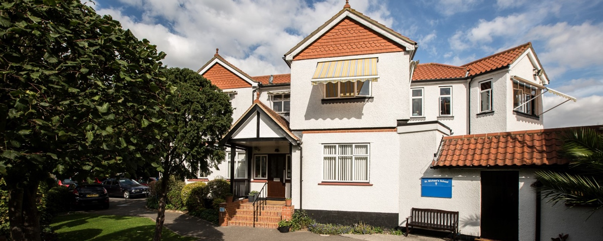
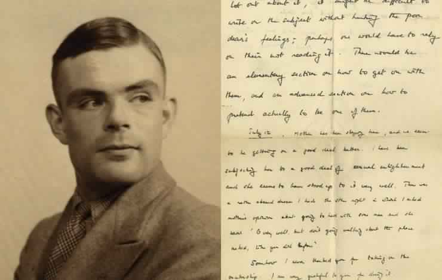
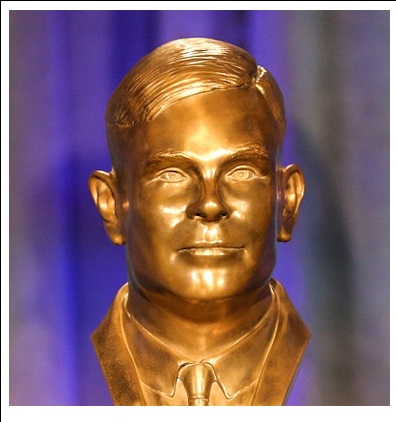
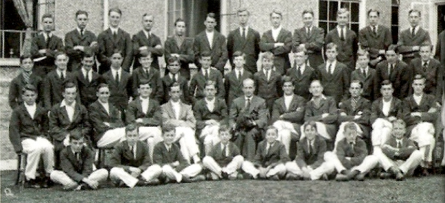
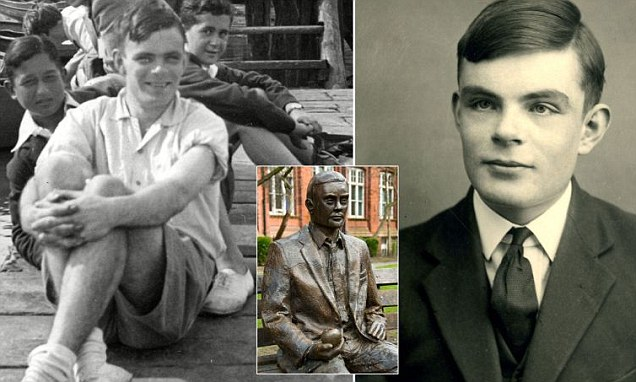
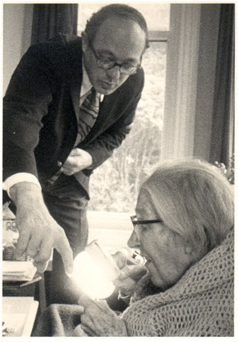
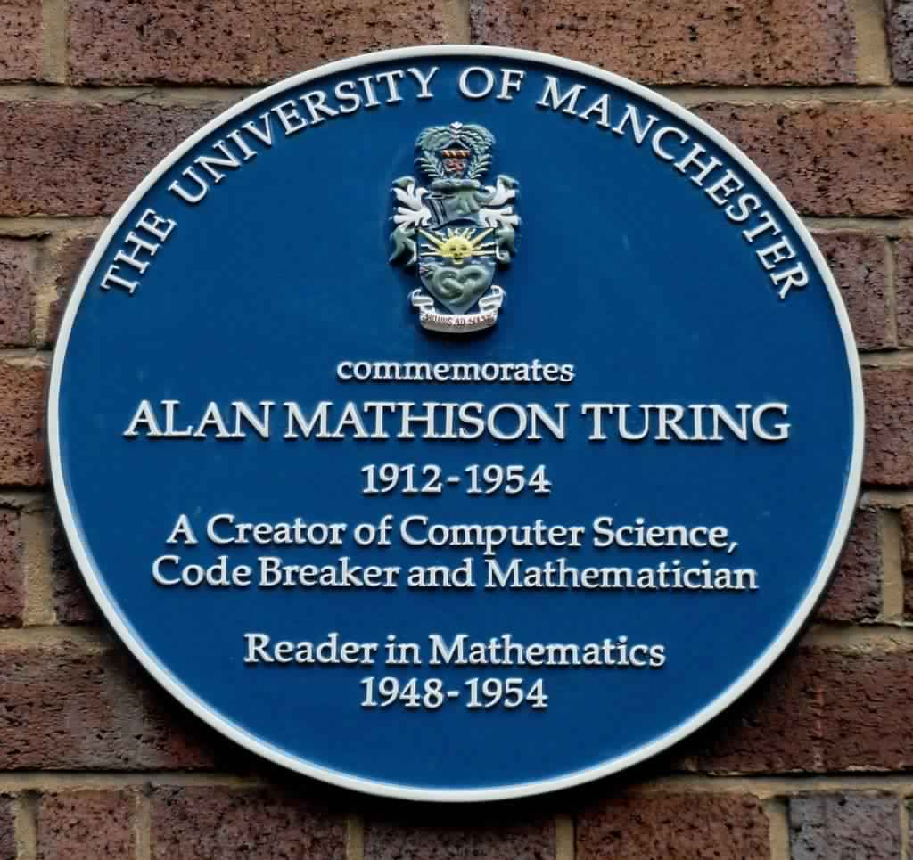

&nbsp;

<h1>Alan Mathison Turing</h1>

BRITISH MATHEMATICIAN AND LOGICIAN

&nbsp;

<strong>Born:</strong>&nbsp;

&nbsp;23 June 1912 Maida Vale, London, England

 <strong>Died</strong>&nbsp;:

&nbsp;7 June 1954 (aged 41) Wilmslow, Cheshire, England

 <strong>Cause of death:&nbsp;</strong>

&nbsp;Cyanide poisoning

 <strong>Resting place:&nbsp;</strong>

&nbsp;Ashes scattered near Woking Crematorium

 <strong>Residence:</strong>

&nbsp;Wilmslow, Cheshire, England

 <strong>Education:</strong>

King's College, Cambridge (BA, MA) Princeton University (PhD)

 <strong>Known for:</strong>

Cryptanalysis of the Enigma Turing's proof Turing machine Turing test Unorganised machine LU decomposition

 <strong>Awards:</strong>

Smith's Prize (1936)

&nbsp;

<strong>Scientific career:</strong>

 <strong>Fields</strong>

Logic Mathematics Cryptanalysis Computer science Mathematical and theoretical biology

 <strong>Institutions:</strong>

University of Manchester Government Code and Cypher School National Physical Laboratory

 <strong>Thesis:</strong>

&nbsp;Systems of Logic Based on Ordinals (1938)

 <strong>Doctoral advisor:</strong>

&nbsp;Alonzo Church

 <strong>Doctoral students:</strong>

&nbsp;Robin Gandy

 <strong>Influences:</strong>

&nbsp;Max Newman

&nbsp;

<strong>Signature:</strong>

&nbsp;

<strong>Further reading </strong>

1.  Computing Machinery and Intelligence By Alan Turing 
              
      <a href="https://github.com/manjunath5496/Alan-Turing-Digital-Archive/blob/master/t1.pdf" target="_blank" style="text-decoration:none">  
 Download
 </a> 

2.  Systems of Logic Based on Ordinals By Alan Turing  <a href="https://github.com/manjunath5496/Alan-Turing-Digital-Archive/blob/master/t2.pdf" target="_blank" style="text-decoration:none">  
 Download
 </a> 

3.  The Applications of Probability to Cryptography By Alan Turing  <a href="https://github.com/manjunath5496/Alan-Turing-Digital-Archive/blob/master/t3.pdf" target="_blank" style="text-decoration:none">  
 Download
 </a> 

4.  Turing's Treatise on the Enigma By Alan Turing  <a href="https://drive.google.com/file/d/1Q7zmJ2kAkvvvnzRCnjnZx3wBdRO3Rp6A/view?usp=sharing" target="_blank" style="text-decoration:none">  
 Download
 </a> 

5.  The Annotated Turing: A Guided Tour Through Alan Turing's Historic Paper on Computability and the Turing Machine By 
Charles Petzold  <a href="https://github.com/manjunath5496/Alan-Turing-Digital-Archive/blob/master/t5.pdf" target="_blank" style="text-decoration:none">  
 Download
 </a> 

6.  Turing, Father of the Modern Computer By B. Jack Copeland   <a href="https://github.com/manjunath5496/Alan-Turing-Digital-Archive/blob/master/t6.pdf" target="_blank" style="text-decoration:none">  
 Download
 </a> 

7.  Alan Turing's Automatic Computing Engine By B. Jack Copeland   <a href="https://github.com/manjunath5496/Alan-Turing-Digital-Archive/blob/master/t7.pdf" target="_blank" style="text-decoration:none">  
 Download
 </a> 

8.  Alan Turing By Geoff Wilkins   <a href="https://github.com/manjunath5496/Alan-Turing-Digital-Archive/blob/master/t8.pdf" target="_blank" style="text-decoration:none">  
 Download
 </a> 

9.  Turing Arts Symposium  By Cate Dowd   <a href="https://github.com/manjunath5496/Alan-Turing-Digital-Archive/blob/master/t9.pdf" target="_blank" style="text-decoration:none">  
 Download
 </a> 

10.  A Bibliography of Publications of Alan Mathison Turing By Nelson H. F. Beebe   <a href="https://github.com/manjunath5496/Alan-Turing-Digital-Archive/blob/master/t10.pdf" target="_blank" style="text-decoration:none">  
 Download
 </a> 

11.  Alan Turing: His Work and Impact By Jan van Leeuwen   <a href="https://drive.google.com/file/d/1hOlmAej0yrFql7-3hS28EgvtKKDg2DLf/view?usp=sharing" target="_blank" style="text-decoration:none">  
 Download
 </a> 

12.  The Essential Turing By B. Jack Copeland   <a href="https://github.com/manjunath5496/Alan-Turing-Digital-Archive/blob/master/t12.pdf" target="_blank" style="text-decoration:none">  
 Download
 </a> 

13.  Mathematics in the Age of the Turing Machine By Thomas C. Hales   <a href="https://github.com/manjunath5496/Alan-Turing-Digital-Archive/blob/master/t13.pdf" target="_blank" style="text-decoration:none">  
 Download
 </a> 

14.  Letter to Alan Turing By Giuseppe Longo   <a href="https://github.com/manjunath5496/Alan-Turing-Digital-Archive/blob/master/t14.pdf" target="_blank" style="text-decoration:none">  
 Download
 </a> 

15.  The Legacy of Turing in Numerical Analysis By Felipe Cucker   <a href="https://github.com/manjunath5496/Alan-Turing-Digital-Archive/blob/master/t15.pdf" target="_blank" style="text-decoration:none">  
 Download
 </a> 

16.  The Turing Test   <a href="https://github.com/manjunath5496/Alan-Turing-Digital-Archive/blob/master/t16.pdf" target="_blank" style="text-decoration:none">  
 Download
 </a> 

17.  Alan Turing: The Hidden Wartime Manuscript By the Father of Computing   <a href="https://github.com/manjunath5496/Alan-Turing-Digital-Archive/blob/master/t17.pdf" target="_blank" style="text-decoration:none">  
 Download
 </a> 

18.  Alan Turing and the Origins of Modern Gaussian Elimination By Froil&#225;n M. Dopico   <a href="https://github.com/manjunath5496/Alan-Turing-Digital-Archive/blob/master/t18.pdf" target="_blank" style="text-decoration:none">  
 Download
 </a> 

19.  Alan Turing and the Turing Award Winners By Luis Lamb   <a href="https://github.com/manjunath5496/Alan-Turing-Digital-Archive/blob/master/t19.pdf" target="_blank" style="text-decoration:none">  
 Download
 </a> 

20.  The Life and Intelligence of Alan Turing By Denbigh Starkey   <a href="https://github.com/manjunath5496/Alan-Turing-Digital-Archive/blob/master/t20.pdf" target="_blank" style="text-decoration:none">  
 Download
 </a> 

21.  The Incomputable Alan Turing By S. Barry Cooper   <a href="https://github.com/manjunath5496/Alan-Turing-Digital-Archive/blob/master/t21.pdf" target="_blank" style="text-decoration:none">  
 Download
 </a> 

22.  Alan Turing, Enigma, and the Breaking of German Machine Ciphers in World War II By Lee A. Gladwin   <a href="https://github.com/manjunath5496/Alan-Turing-Digital-Archive/blob/master/t22.pdf" target="_blank" style="text-decoration:none">  
 Download
 </a> 

23.  Alan Turing's Forgotten Ideas in Computer Science By Diane Proudfoot   <a href="https://github.com/manjunath5496/Alan-Turing-Digital-Archive/blob/master/t23.pdf" target="_blank" style="text-decoration:none">  
 Download
 </a> 

24.  Alan Turing "Founder of Computer Science" By Prof. Jonathan P. Bowen   <a href="https://github.com/manjunath5496/Alan-Turing-Digital-Archive/blob/master/t24.pdf" target="_blank" style="text-decoration:none">  
 Download
 </a> 

25. The Ghost in the Quantum Turing Machine By Scott Aaronson   <a href="https://github.com/manjunath5496/Alan-Turing-Digital-Archive/blob/master/t25.pdf" target="_blank" style="text-decoration:none">  
 Download
 </a> 

26. The Turing Test: Then and Now By Peter Hawke   <a href="https://github.com/manjunath5496/Alan-Turing-Digital-Archive/blob/master/t26.pdf" target="_blank" style="text-decoration:none">  
 Download
 </a> 

27. Turing-Post Relativized Computability and Interactive Computing By Robert Irving Soare   <a href="https://github.com/manjunath5496/Alan-Turing-Digital-Archive/blob/master/t27.pdf" target="_blank" style="text-decoration:none">  
 Download
 </a> 

28. Alan Turing, Computing, Bletchley, and Mathematics By Rod Downey   <a href="https://github.com/manjunath5496/Alan-Turing-Digital-Archive/blob/master/t28.pdf" target="_blank" style="text-decoration:none">  
 Download
 </a> 

29. AM Turing's ACE Report of 1946 and other papers   <a href="https://github.com/manjunath5496/Alan-Turing-Digital-Archive/blob/master/t29.pdf" target="_blank" style="text-decoration:none">  
 Download
 </a> 

30. Alan Turing and the Decision Problem By Richard Zach  <a href="https://github.com/manjunath5496/Alan-Turing-Digital-Archive/blob/master/t30.pdf" target="_blank" style="text-decoration:none">  
 Download
 </a> 

31. On Computable Numbers, with an Application to the Entscheidungsproblem By Alan Turing  <a href="https://github.com/manjunath5496/Alan-Turing-Digital-Archive/blob/master/t31.pdf" target="_blank" style="text-decoration:none">  
 Download
 </a> 

32. La Machine de Turing   <a href="https://github.com/manjunath5496/Alan-Turing-Digital-Archive/blob/master/t32.pdf" target="_blank" style="text-decoration:none">  
 Download
 </a> 

33. The Chemical Basis of Morphogenesis By Alan Turing   <a href="https://github.com/manjunath5496/Alan-Turing-Digital-Archive/blob/master/t33.pdf" target="_blank" style="text-decoration:none">  
 Download
 </a> 

34. Turing's Mathematical Work By P.D. Welch   <a href="https://github.com/manjunath5496/Alan-Turing-Digital-Archive/blob/master/t34.pdf" target="_blank" style="text-decoration:none">  
 Download
 </a> 

35. Intelligent Machinery A Heretical Theory; reprinted in (Copeland 2004)   <a href="https://github.com/manjunath5496/Alan-Turing-Digital-Archive/blob/master/t35.pdf" target="_blank" style="text-decoration:none">  
 Download
 </a> 

36. RO Gandy An Early Proof of Normalization By Alan Turing  <a href="https://github.com/manjunath5496/Alan-Turing-Digital-Archive/blob/master/t36.pdf" target="_blank" style="text-decoration:none">  
 Download
 </a> 

37. An Early Program Proof By Alan Turing  <a href="https://github.com/manjunath5496/Alan-Turing-Digital-Archive/blob/master/t37.pdf" target="_blank" style="text-decoration:none">  
 Download
 </a> 

38. On Alan Turing and the Origins of Digital Computers By B. Randell  <a href="https://github.com/manjunath5496/Alan-Turing-Digital-Archive/blob/master/t38.pdf" target="_blank" style="text-decoration:none">  
 Download
 </a> 

39. The Genius of Alan Turing: The Computing Classical Model By Luís Homem  <a href="https://github.com/manjunath5496/Alan-Turing-Digital-Archive/blob/master/t39.pdf" target="_blank" style="text-decoration:none">  
 Download
 </a> 

40. Alan Turing and the Other Theory of Computation (expanded) By Lenore Blum  <a href="https://github.com/manjunath5496/Alan-Turing-Digital-Archive/blob/master/t40.pdf" target="_blank" style="text-decoration:none">  
 Download
 </a> 

41. Alan Turing's Chemical Theory of Phyllotaxis By M.D. Rueda-Contreras  <a href="https://github.com/manjunath5496/Alan-Turing-Digital-Archive/blob/master/t41.pdf" target="_blank" style="text-decoration:none">  
 Download
 </a> 

42. ACM Turing Award Lectures: The First Twenty Years (1966 &minus; 1985)  <a href="https://github.com/manjunath5496/Alan-Turing-Digital-Archive/blob/master/t42.pdf" target="_blank" style="text-decoration:none">  
 Download
 </a> 

43. Mathematical Logic By Alan Turing  <a href="https://github.com/manjunath5496/Alan-Turing-Digital-Archive/blob/master/t43.pdf" target="_blank" style="text-decoration:none">  
 Download
 </a> 

44. Parsing the Turing Test By Gary Roberts  <a href="https://github.com/manjunath5496/Alan-Turing-Digital-Archive/blob/master/t44.pdf" target="_blank" style="text-decoration:none">  
 Download
 </a> 

45. Thinking about Godel and Turing: Essays on Complexity, 1970 &minus; 2007  <a href="https://github.com/manjunath5496/Alan-Turing-Digital-Archive/blob/master/t45.pdf" target="_blank" style="text-decoration:none">  
 Download
 </a> 

46. Turing (A Novel about Computation) By Christos Papadimitriou  <a href="https://github.com/manjunath5496/Alan-Turing-Digital-Archive/blob/master/t46.pdf" target="_blank" style="text-decoration:none">  
 Download
 </a> 

47. Turing Option By Harry Harrison  <a href="https://github.com/manjunath5496/Alan-Turing-Digital-Archive/blob/master/t47.pdf" target="_blank" style="text-decoration:none">  
 Download
 </a> 

48. Alan Turing: The Logical and Physical Basis of Computing By Andrew Hodges  <a href="https://github.com/manjunath5496/Alan-Turing-Digital-Archive/blob/master/t48.pdf" target="_blank" style="text-decoration:none">  
 Download
 </a> 

49. The History of Artificial Intelligence  <a href="https://github.com/manjunath5496/Alan-Turing-Digital-Archive/blob/master/t49.pdf" target="_blank" style="text-decoration:none">  
 Download
 </a> 

50. Mind, Computing Machinery and Intelligence By A.M.Turing  <a href="https://github.com/manjunath5496/Alan-Turing-Digital-Archive/blob/master/t50.pdf" target="_blank" style="text-decoration:none">  
 Download
 </a> 

51. Alan Turing and Number Theory  <a href="https://github.com/manjunath5496/Alan-Turing-Digital-Archive/blob/master/t51.pdf" target="_blank" style="text-decoration:none">  
 Download
 </a> 

52. Alan Turing: The Enigma By Andrew Hodges   <a href="https://github.com/manjunath5496/Alan-Turing-Digital-Archive/blob/master/t52.pdf" target="_blank" style="text-decoration:none">  
 Download
 </a> 

53. A Madman Dreams of Turing Machines By Janna Levin   <a href="https://github.com/manjunath5496/Alan-Turing-Digital-Archive/blob/master/t53.pdf" target="_blank" style="text-decoration:none">  
 Download
 </a> 

54. Computing Over The Reals Where Turing Meets Newton   <a href="https://github.com/manjunath5496/Alan-Turing-Digital-Archive/blob/master/t54.pdf" target="_blank" style="text-decoration:none">  
 Download
 </a> 

55. Die Turing Option By Marvin Minsky  <a href="https://github.com/manjunath5496/Alan-Turing-Digital-Archive/blob/master/t55.pdf" target="_blank" style="text-decoration:none">  
 Download
 </a> 

56. Hypercomputation: Computing Beyond the Church &minus; Turing Barrier  <a href="https://github.com/manjunath5496/Alan-Turing-Digital-Archive/blob/master/t56.pdf" target="_blank" style="text-decoration:none">  
 Download
 </a> 

57. The Turing Test (Doctor Who Series)   <a href="https://github.com/manjunath5496/Alan-Turing-Digital-Archive/blob/master/t57.pdf" target="_blank" style="text-decoration:none">  
 Download
 </a> 

58. Thinking On The Web: Berners-Lee, Godel And Turing   <a href="https://github.com/manjunath5496/Alan-Turing-Digital-Archive/blob/master/t58.pdf" target="_blank" style="text-decoration:none">  
 Download
 </a> 

59. Alan Turing and the Development of Artificial Intelligence   <a href="https://github.com/manjunath5496/Alan-Turing-Digital-Archive/blob/master/t59.pdf" target="_blank" style="text-decoration:none">  
 Download
 </a> 

60. Alan Turing Archive   <a href="https://github.com/manjunath5496/Alan-Turing-Digital-Archive/blob/master/t60.pdf" target="_blank" style="text-decoration:none">  
 Download
 </a> 

61. Can Digital Computers Think? By Alan Turing    <a href="https://github.com/manjunath5496/Alan-Turing-Digital-Archive/blob/master/t61.pdf" target="_blank" style="text-decoration:none">  
 Download
 </a> 

62. Turing Machines, Computers, And Artificial Intelligence By Peter R. Krebs    <a href="https://github.com/manjunath5496/Alan-Turing-Digital-Archive/blob/master/t62.pdf" target="_blank" style="text-decoration:none">  
 Download
 </a> 

63. Turing Machines with Sublogarithmic Space By Andrzej Szepietowski    <a href="https://github.com/manjunath5496/Alan-Turing-Digital-Archive/blob/master/t63.pdf" target="_blank" style="text-decoration:none">  
 Download
 </a> 

64. The Automatic Computing Machine By Alan Turing   <a href="https://github.com/manjunath5496/Alan-Turing-Digital-Archive/blob/master/t64.pdf" target="_blank" style="text-decoration:none">  
 Download
 </a> 

65. The Imitation Game By Graham Moore   <a href="https://github.com/manjunath5496/Alan-Turing-Digital-Archive/blob/master/t65.pdf" target="_blank" style="text-decoration:none">  
 Download
 </a> 

66. Breaking Enigma By Jeremy Wright   <a href="https://github.com/manjunath5496/Alan-Turing-Digital-Archive/blob/master/t66.pdf" target="_blank" style="text-decoration:none">  
 Download
 </a> 

67. Breaking Enigma and the U-boat Codes and the Legacy of Alan Turing   <a href="https://github.com/manjunath5496/Alan-Turing-Digital-Archive/blob/master/t67.pdf" target="_blank" style="text-decoration:none">  
 Download
 </a> 

68. Alan Turing and Enigmatic Statistics By S. Barry Cooper   <a href="https://github.com/manjunath5496/Alan-Turing-Digital-Archive/blob/master/t68.pdf" target="_blank" style="text-decoration:none">  
 Download
 </a> 

69. Letter to Norman Routledge By Alan Turing   <a href="https://github.com/manjunath5496/Alan-Turing-Digital-Archive/blob/master/t69.pdf" target="_blank" style="text-decoration:none">  
 Download
 </a> 

70. Maths from the talk: "Alan Turing and the Enigma Machine"   <a href="https://github.com/manjunath5496/Alan-Turing-Digital-Archive/blob/master/t70.pdf" target="_blank" style="text-decoration:none">  
 Download
 </a> 

71. The Genius Who Gave Us The Future: 100 years of Alan Turing   <a href="https://github.com/manjunath5496/Alan-Turing-Digital-Archive/blob/master/t71.pdf" target="_blank" style="text-decoration:none">  
 Download
 </a> 

72. Turing and the Computer By Diane Proudfoot  <a href="https://github.com/manjunath5496/Alan-Turing-Digital-Archive/blob/master/t72.pdf" target="_blank" style="text-decoration:none">  
 Download
 </a> 

73. Alan Turing at Bletchley Park in World War II By Tony Sale  <a href="https://github.com/manjunath5496/Alan-Turing-Digital-Archive/blob/master/t73.pdf" target="_blank" style="text-decoration:none">  
 Download
 </a> 

74. Alan Turing: Life and Legacy of a Great Thinker By D Hofstadter  <a href="https://github.com/manjunath5496/Alan-Turing-Digital-Archive/blob/master/t74.pdf" target="_blank" style="text-decoration:none">  
 Download
 </a> 

75. The Enigma Machine By Eric Roberts  <a href="https://github.com/manjunath5496/Alan-Turing-Digital-Archive/blob/master/t75.pdf" target="_blank" style="text-decoration:none">  
 Download
 </a> 

76. The Military Use of Alan Turing By Andrew Hodges  <a href="https://github.com/manjunath5496/Alan-Turing-Digital-Archive/blob/master/t76.pdf" target="_blank" style="text-decoration:none">  
 Download
 </a> 

77. Dr. Alan Turing "Father of Computer Science and Philosopher" By Paul Conn  <a href="https://github.com/manjunath5496/Alan-Turing-Digital-Archive/blob/master/t77.pdf" target="_blank" style="text-decoration:none">  
 Download
 </a> 

78. Turing and von Neumann's Brains and their Computers  <a href="https://github.com/manjunath5496/Alan-Turing-Digital-Archive/blob/master/t78.pdf" target="_blank" style="text-decoration:none">  
 Download
 </a> 

79. Cryptography and Alan Turing  <a href="https://github.com/manjunath5496/Alan-Turing-Digital-Archive/blob/master/t79.pdf" target="_blank" style="text-decoration:none">  
 Download
 </a> 

80. Undecidable problems  <a href="https://github.com/manjunath5496/Alan-Turing-Digital-Archive/blob/master/t80.pdf" target="_blank" style="text-decoration:none">  
 Download
 </a> 

81. Alan Turing: Designs first computer    <a href="https://github.com/manjunath5496/Alan-Turing-Digital-Archive/blob/master/t81.pdf" target="_blank" style="text-decoration:none">  
 Download
 </a> 

82.  Alan Turing: Convicted for gross indecency   <a href="https://github.com/manjunath5496/Alan-Turing-Digital-Archive/blob/master/t82.pdf" target="_blank" style="text-decoration:none">  
 Download
 </a> 

83.  Alan Turing: Suicide   <a href="https://github.com/manjunath5496/Alan-Turing-Digital-Archive/blob/master/t83.pdf" target="_blank" style="text-decoration:none">  
 Download
 </a> 

84.  Alan Turing: Devastated by his friend's death   <a href="https://github.com/manjunath5496/Alan-Turing-Digital-Archive/blob/master/t84.pdf" target="_blank" style="text-decoration:none">  
 Download
 </a> 

85.  Universal Turing machine: a design for a multi-purpose computer    <a href="https://github.com/manjunath5496/Alan-Turing-Digital-Archive/blob/master/t85.pdf" target="_blank" style="text-decoration:none">  
 Download
 </a> 

86. Turing's Test and Believable AI in Games  <a href="https://github.com/manjunath5496/Alan-Turing-Digital-Archive/blob/master/t86.pdf" target="_blank" style="text-decoration:none">  
 Download
 </a>
 

87. What Kind of Turing Test Did Turing Have in Mind? By Jean Lass&#232;gue  <a href="https://github.com/manjunath5496/Alan-Turing-Digital-Archive/blob/master/t87.pdf" target="_blank" style="text-decoration:none">  
 Download
 </a>
 

88. Historical Reflections Actually, Turing Did Not Invent the Computer  <a href="https://github.com/manjunath5496/Alan-Turing-Digital-Archive/blob/master/t88.pdf" target="_blank" style="text-decoration:none">  
 Download
 </a>
 

89. Turing's Theory of Morphogenesis: Where We Started, Where We Are and Where We Want to Go  <a href="https://github.com/manjunath5496/Alan-Turing-Digital-Archive/blob/master/t89.pdf" target="_blank" style="text-decoration:none">  
 Download
 </a>
 

90. Alan Turing &minus; Einstein of Computer Science   <a href="https://github.com/manjunath5496/Alan-Turing-Digital-Archive/blob/master/t90.pdf" target="_blank" style="text-decoration:none">  
 Download
 </a>
 

91. Educating a Mathematical Genius: Alan Turing at Sherborne School  <a href="https://github.com/manjunath5496/Alan-Turing-Digital-Archive/blob/master/t91.pdf" target="_blank" style="text-decoration:none">  
 Download
 </a>
 

92. After 1952: The later development of Alan Turing's ideas on the mathematics of pattern formation  <a href="https://github.com/manjunath5496/Alan-Turing-Digital-Archive/blob/master/t92.pdf" target="_blank" style="text-decoration:none">  
 Download
 </a>
 

93. Alan Turing (1912&minus;1954) By Ong Marc-us  <a href="https://github.com/manjunath5496/Alan-Turing-Digital-Archive/blob/master/t93.pdf" target="_blank" style="text-decoration:none">  
 Download
 </a>
 

94. Turing's Test and conscious thought  <a href="https://github.com/manjunath5496/Alan-Turing-Digital-Archive/blob/master/t94.pdf" target="_blank" style="text-decoration:none">  
 Download
 </a>
 

95. Sara Turing: Alan M. Turing, Cambridge University Press, 2012  <a href="https://github.com/manjunath5496/Alan-Turing-Digital-Archive/blob/master/t95.pdf" target="_blank" style="text-decoration:none">  
 Download
 </a>
 

96. Turing Lectures  <a href="https://drive.google.com/file/d/1mRViSv0B50QuTq0Ybz9XSz0lojFiv8s0/view?usp=sharing" target="_blank" style="text-decoration:none">  
 Download
 </a>
 

97. A Bibliography of the ACM Turing Awards  <a href="https://github.com/manjunath5496/Alan-Turing-Digital-Archive/blob/master/t97.pdf" target="_blank" style="text-decoration:none">  
 Download
 </a>
 

98. Turing's Real Machines By Michael R. Williams  <a href="https://github.com/manjunath5496/Alan-Turing-Digital-Archive/blob/master/t98.pdf" target="_blank" style="text-decoration:none">  
 Download
 </a>
 

99. A Chosen IV Attack Against Turing  <a href="https://github.com/manjunath5496/Alan-Turing-Digital-Archive/blob/master/t99.pdf" target="_blank" style="text-decoration:none">  
 Download
 </a>
 

100. Laplace, Turing and the "imitation game" impossible geometry: randomness, determinism and programs in Turing's test  <a href="https://github.com/manjunath5496/Alan-Turing-Digital-Archive/blob/master/t100.pdf" target="_blank" style="text-decoration:none">  
 Download
 </a>
 

101. Cryptography and Computation after Turing  <a href="https://github.com/manjunath5496/Alan-Turing-Digital-Archive/blob/master/t101.pdf" target="_blank" style="text-decoration:none">  
 Download
 </a>
 

102. Number Theory II By Tom Leighton and Ronitt Rubinfeld  <a href="https://github.com/manjunath5496/Alan-Turing-Digital-Archive/blob/master/t102.pdf" target="_blank" style="text-decoration:none">  
 Download
 </a>
 

103. Historical Reflections Colossal Genius: Tutte, Flowers, and a Bad Imitation of Turing  <a href="https://github.com/manjunath5496/Alan-Turing-Digital-Archive/blob/master/t103.pdf" target="_blank" style="text-decoration:none">  
 Download
 </a>
 

104. Turing and the Enigma Cipher  <a href="https://github.com/manjunath5496/Alan-Turing-Digital-Archive/blob/master/t104.pdf" target="_blank" style="text-decoration:none">  
 Download
 </a>
 

105. Turing's Ideas and Models of Computation  <a href="https://github.com/manjunath5496/Alan-Turing-Digital-Archive/blob/master/t105.pdf" target="_blank" style="text-decoration:none">  
 Download
 </a>
 

106. A Man of Machines  <a href="https://github.com/manjunath5496/Alan-Turing-Digital-Archive/blob/master/t106.pdf" target="_blank" style="text-decoration:none">  
 Download
 </a>
 

107. Turing. A Staged Case History  <a href="https://drive.google.com/file/d/1JYqNgS47fVlnlrYTlRsPl2yXwKxM0jPA/view?usp=sharing" target="_blank" style="text-decoration:none">  
 Download
 </a>
 

108. Bletchley's Secret War: British Code Breaking in the Battle of the Atlantic   <a href="https://github.com/manjunath5496/Alan-Turing-Digital-Archive/blob/master/t108.pdf" target="_blank" style="text-decoration:none">  
 Download
 </a>
 

109. The Turing Test as Interactive Proof   <a href="https://github.com/manjunath5496/Alan-Turing-Digital-Archive/blob/master/t109.pdf" target="_blank" style="text-decoration:none">  
 Download
 </a>
 

110. Pushing Back the Incomputable &minus; Alan Turing's Ten Big Ideas  <a href="https://github.com/manjunath5496/Alan-Turing-Digital-Archive/blob/master/t110.pdf" target="_blank" style="text-decoration:none">  
 Download
 </a>
 

111. Life in Code and Digits: When Shannon met Turing  <a href="https://github.com/manjunath5496/Alan-Turing-Digital-Archive/blob/master/t111.pdf" target="_blank" style="text-decoration:none">  
 Download
 </a>
 

112. Alan Turing&minus;Report Card Teachers' Comments, 1926&minus;1931  <a href="https://github.com/manjunath5496/Alan-Turing-Digital-Archive/blob/master/t112.pdf" target="_blank" style="text-decoration:none">  
 Download
 </a>
 

113. Biographical Memoirs &minus; Alan Turing  <a href="https://github.com/manjunath5496/Alan-Turing-Digital-Archive/blob/master/t113.pdf" target="_blank" style="text-decoration:none">  
 Download
 </a>
 

114. The Gay Man Who Defeated Nazi Germany  <a href="https://github.com/manjunath5496/Alan-Turing-Digital-Archive/blob/master/et.pdf" target="_blank" style="text-decoration:none">  
 Download
 </a>
 

115. Alan Turing, the Politics of Sexual Science, and the Making of a Gay Icon  <a href="https://github.com/manjunath5496/Alan-Turing-Digital-Archive/blob/master/bt.pdf" target="_blank" style="text-decoration:none">  
 Download
 </a>
 

&nbsp;

&nbsp;

<strong>Turing, age 5.</strong>&nbsp;

&nbsp;

<strong>Turing starts his school education at the age of six at St. Michael's School.</strong>&nbsp;

&nbsp;

<strong>Alan Turing as a boy.</strong>&nbsp;

&nbsp;

<strong>Alan Turing with his mother Ethel Sara Turing.</strong>&nbsp;

&nbsp;

<strong>Alan Turing with his mother and brother on a beach on the South Coast of England in 1913.</strong>&nbsp;

&nbsp;

<strong>Alan and his elder brother John.</strong>&nbsp;

&nbsp;

<strong>Drawing of Alan Turing by his mother, at his preparatory school, Hazelhurst, Sussex, 1923.</strong>&nbsp;

&nbsp;

<strong>Preparatory school, Hazelhurst.</strong>&nbsp;

&nbsp;

<strong>Turing and friends on a Cornish beach, April 1930.</strong>&nbsp;

&nbsp;

<strong>Alan Turing, second from right, with (L-R) Hogg, Geoffrey OHanlon (housemaster) and White.</strong>&nbsp;

&nbsp;

<strong>Alan Turing with school friends, Robin and John Wainwright and Hugh Highet.</strong>&nbsp;

&nbsp;

<strong>Turing in a photo from his days at the Sherborne School. </strong>&nbsp;

&nbsp;

<strong>Alan Turing, aged 15, at Westcott House, Sherborne School. </strong>&nbsp;

&nbsp;

<strong> Sherborne School.</strong>&nbsp;

&nbsp;

<strong>Alan Turing's school report when he was 16-years-old.</strong>&nbsp;

&nbsp;

<strong>This is the copy of the school prize which Turing chose in honour of his 'first love' Christopher Morcom.</strong>&nbsp;

&nbsp;

<strong>Christopher Morcom with his parents in 1929.</strong>&nbsp;

&nbsp;

<strong>Turing, age 18, next to Ben Davis, head of Mathematics at Sherborne School.  </strong>&nbsp;

&nbsp;

<strong>Young Alan Turing.</strong>&nbsp;

&nbsp;

<strong>Alan Turing aged 19, bathing on the island of Sark</strong>&nbsp;

&nbsp;

<strong>Alan Turing in his early 20s.</strong>&nbsp;

&nbsp;

<strong>Turing running. </strong>&nbsp;

&nbsp;

<strong>Turing reading.</strong>&nbsp;

&nbsp;

<strong>Turing (right) and Mermagen in their last year at Sherborne.</strong>&nbsp;

&nbsp;

<strong>Alan Turing in 1934.</strong>&nbsp;

&nbsp;

<strong>Hut 8, where Turing's Naval Enigma section was based.</strong>&nbsp;

&nbsp;

<strong>The young Alan Turing in more innocent times.</strong>&nbsp;

&nbsp;

<strong>As a fellow at King's, Cambridge.</strong>&nbsp;

&nbsp;

<strong> On the right is a rare snapshot of Alan Turing in a seminar at Princeton at this period.</strong>&nbsp;

&nbsp;

<strong> Princeton University.</strong>&nbsp;

&nbsp;

<strong>Alan Turing in a boat just before the Second World War.</strong>&nbsp;

&nbsp;

<strong>Alan Turing (far left) on a bus.</strong>&nbsp;

&nbsp;

<strong>Alan Turing in a garden in Dene Road, Guildford in 1928.</strong>&nbsp;

&nbsp;

<strong>Ratio Club at Cambridge 1952, Giles Brindley (yellow), Donald MacKay (red), Alan Turing (green).</strong>&nbsp;

&nbsp;

<strong>Alan Turing (right) stands next to the Ferranti Mark I. </strong>&nbsp;

&nbsp;

<strong> Conceptualization of the Turing Machine invented by Turing in 1936.</strong>&nbsp;

&nbsp;

<strong> Mechanical Wooden Turing Machine.</strong>&nbsp;

&nbsp;

<strong>This is a Turing machine built from Legos. It's a theoretical machine Turing designed for computing in the late 30s.</strong>&nbsp;

&nbsp;

<strong>A letter which Alan Turing sent to his mother.</strong>&nbsp;

&nbsp;

<strong>Despite his death being ruled suicide, Turing's mother said it was 'quite probably' his death from cyanide poisoning was a mistake.</strong>&nbsp;

&nbsp;

<strong>Alan Turing memorial &minus; Manchester</strong>&nbsp;

&nbsp;

<strong>Turing lived the last years of his life at this home in Wilmslow, Cheshire near Manchester. He took his own life at this house on June 7, 1954.</strong>&nbsp;

&nbsp;

<strong>Turing led the Naval Enigma codebreaking efforts from this office in Hut 8. The building at Bletchley Park has been fully restored.</strong>&nbsp;

&nbsp;

<strong>Hut 8 at Bletchley Park is the building Turing worked in during the early years of World War II. Turing was instrumental in breaking the German naval Enigma code.</strong>&nbsp;

&nbsp;

<strong>In 1931, Turing began his studies at King's College, Cambridge.</strong>&nbsp;

&nbsp;

<strong>Two cottages in the stable yard at Bletchley Park. Turing worked here in 1939 and 1940, before moving to Hut 8.</strong>&nbsp;

&nbsp;

<strong>Alan Turing's OBE currently held in Sherborne School archives.</strong>&nbsp;

&nbsp;

<strong>Photograph of Alan Turing statue at University of Surrey.</strong>&nbsp;

&nbsp;

<strong>Turing's statue at Bletchley Park (made of layers of stacked slate, shown from the chest up).</strong>&nbsp;

&nbsp;

<strong>Bombe machine</strong>&nbsp;

 Bombe machine, a code-breaking machine, originally developed by Alan Turing and others, used during World War II.

&nbsp;

<strong>Turing memorial statue plaque in Sackville Park, Manchester.</strong>&nbsp;

&nbsp;

<strong>Welsh codebreaker Mair Russell-Jones recognised Alan Turing's genius at an early age at Bletchley Park.</strong>&nbsp;

&nbsp;

<strong>During World War II, Bletchley Park housed the UK's code breaking efforts against the Axis powers. Turing worked here.</strong>&nbsp;

&nbsp;

<strong>Turing was recruited to the National Physical Laboratory in 1945.</strong>&nbsp;

&nbsp;

<strong>Alan Turing's codebreakers decoding of the Enigma Machine helped win World War II.</strong>&nbsp;

&nbsp;

<strong>&nbsp;</strong>&nbsp;

&nbsp;

<strong>ALAN TURING: Bletchley Park will reopen as the National College of Cyber Security.</strong>&nbsp;

&nbsp;

<strong>U-BOATS: Breaking the Enigma code allowed Brit ships to evade German U-boats.</strong>&nbsp;

&nbsp;

<strong>A page from the notebook of British mathematician and pioneer in computer science Alan Turing, displayed in front of his portrait during an auction preview in Hong Kong.</strong>&nbsp;

&nbsp;

<strong>Cassandra Hatton, senior specialist in fine books and manuscripts and director of the history of science from Bonhams auction house, shows a notebook of British mathematician and pioneer in computer science Alan Turing, during an auction preview in Hong Kong.</strong>&nbsp;

&nbsp;

<strong>The DEUCE: Digital Electronic Universal Computing Engine, was the first commercially produced digital model and was developed from earlier plans by Alan Turing.</strong>&nbsp;

&nbsp;

<strong>  A rare manuscript belonging to British mathematician and code breaker Alan Turing  displayed in Hong Kong on March 19, 2015.</strong>&nbsp;

&nbsp;

<strong>A page from the notebook of codebreaker Alan Turing seen at Bonham's auction house during an auction in New York, on April 13, 2015. The paper, in which he details his work on the foundations of mathematical notation and computer science..</strong>&nbsp;

&nbsp;

<strong>Bonham's senior specialist Cassandra Hatton discusses a working Enigma cipher machine that along with the 1942 56-page notebook belonging to codebreaker Alan Turing.</strong>&nbsp;

&nbsp;

<strong>A working Enigma cipher machine.</strong>&nbsp;

&nbsp;

<strong>A rebuild of a machine made by Alan Turing.</strong>&nbsp;

&nbsp;

<strong>Britain's earliest stored program computers designed by the mathematician Alan Turing (1912&minus;1954) at NPL between 1945 and 1947.</strong>&nbsp;

&nbsp;

<strong>The Queen visits Bletchley Park and studies an Enigma machine. She grants Turing a royal pardon on 23 December 2013.</strong>&nbsp;

&nbsp;

<strong>Alan Turing's Royal Pardon (UK Government).</strong>&nbsp;

&nbsp;

<strong>Signature of Alan Turing's mother Sara, from when she visited after his death.</strong>&nbsp;

&nbsp;

<strong>&nbsp;</strong>&nbsp;

&nbsp;

<strong>Alan Turing Stamp</strong>&nbsp;

&nbsp;

<strong>Alan Turing Letter Reveal Turmoil Over Sexuality, 'Gay Cure' Hormone Therapy</strong>&nbsp;

&nbsp;

<strong>&nbsp;</strong>&nbsp;

&nbsp;

<strong>Letter Alan Turing wrote to Maria Greenbaum in July 1953 with his advice for playing Solitaire.</strong>&nbsp;

&nbsp;

<strong>The detailed letter provided an explanation of how to avoid having pieces scattered around the board, including a series of moves to help crack the puzzle.</strong>&nbsp;

&nbsp;

<strong>He used diagrams to help explain to his niece how she might succeed with the puzzle.</strong>&nbsp;

&nbsp;

<strong>Alan Turing's letter to Christopher Morcom's mother. Christopher was Alan's first love, and he died very young.</strong>&nbsp;

&nbsp;

 

<strong>Letter from Alan Turing to W Ross Ashby.</strong>&nbsp;

&nbsp;

<strong>Alan Turing at the Science Museum.</strong>&nbsp;

&nbsp;

<strong>The blue plaque at Alan Turing's house on Adlington Road.</strong>&nbsp;

&nbsp;

<strong>Bronze bust of Alan Turing presented to ACM by Tom and Grant Mackenzie.</strong>&nbsp;

&nbsp;

<strong>ACM A.M. Turing Award.</strong>&nbsp;

&nbsp;

<strong>A postcard Alan Turing sent to his psychologist "Dr Franz Greenbaum" while on holiday in Corfu.</strong>&nbsp;

&nbsp;

<strong>Note from Alan Turing to Robin Gandy, March 1954.</strong>&nbsp;

&nbsp;

<strong>Message from Turing to Gandy, printed off the Manchester Mark I, ca. 1953.</strong>&nbsp;

&nbsp;

<strong>Alan Turing's Princeton University File.</strong>&nbsp;

&nbsp;

<strong>Extracts from Turing’s notes on the Enigma Machine, c.1939&minus;42.</strong>&nbsp;

&nbsp;

<strong>A unique collection of letters and correspondence from Alan Turing found in an old filing cabinet in a storeroom at the University of Manchester.</strong>&nbsp;

&nbsp;

<strong>Alan Turing autograph.</strong>&nbsp;

&nbsp;

<strong>Visitor's Book signature: Alan Turing's signature 8th from the top.</strong>&nbsp;

&nbsp;

<strong>Alan Turing Letter to Alonzo Church.</strong>&nbsp;

&nbsp;

<strong>Alan Turing Scrapbook.</strong>&nbsp;

&nbsp;

<strong>Referee report by C. G. Darwin on 'On the Chemical basis of Morphogenesis' by A. M. Turing.</strong>&nbsp;

&nbsp;

<strong>This is a photograph of the official record of the charges, pleas, and sentences passed on Alan Turing and Arnold Murray in respect of their crimes, 31 March 1952.</strong>&nbsp;

&nbsp;

<strong>A sample of the handwriting of Alan Turing.</strong>&nbsp;

&nbsp;

<strong>Alan Turing Letter to Dr. N. A. Routledge shortly before his conviction.</strong>&nbsp;

&nbsp;

<strong>Alan Turing's Code-Breaking Papers Discovered In Roof Holes At Bletchley Park.</strong>&nbsp;

&nbsp;

<strong>A sample of Turing's typing.</strong>&nbsp;

&nbsp;

<strong>One of Alan Turing's journals, written while he was hacking away on the German Enigma Code.</strong>&nbsp;

&nbsp;

<strong>The unpublished work by the late Alan Turing (1912&minus;1954). It includes many topics (how to play Go, eliptic functions...) and drawings and calculations related to his theory of morphogenesis.</strong>&nbsp;

&nbsp;

<strong>The Alan Turing Building at the University of Manchester.</strong>&nbsp;

&nbsp;

<strong>The London 2012 Olympic Torch flame was passed on in front of Turing's statue in Manchester on his 100th birthday.</strong>&nbsp;

<strong>Colored diagrams showing patterns of dappling and calculations, made by Turing in connection with work on morphogenesis.</strong>&nbsp;

<strong>Alan Turing Letter to London physicist Donald Mackay.</strong>&nbsp;

<strong>Alan Turing Letter to B H Wood, editor of Chess magazine.</strong>&nbsp;

<strong>Alan Turing on a 2000 "millennium" stamp commemorating his 1937 theory of digital computing.</strong>&nbsp;

<strong> Slate statue of Alan Turing at Bletchley Park with the best-known image of Turing on the wall to the right.</strong>&nbsp;

<strong> Turing (front row far left), aged 13, at Westcott House Sherborne, 1926.</strong>&nbsp;

<strong>&nbsp; </strong>&nbsp;

<strong>&nbsp; </strong>&nbsp;

<strong>Crew of King's College's 2nd boat, May 1935. Alan Turing is second from the Right.</strong>&nbsp;

<strong>Post Mortem Examination report of Alan Turing.</strong>&nbsp;

<strong>Death certificate of Alan Turing.</strong>&nbsp;

<strong> Alan Turing Prize for Science bookplate.</strong>&nbsp;

<strong> Alan Turing Teddy Bear, Bletchley Park Museum.</strong>&nbsp;

<strong>von Neumann's formal letter of reference dated June 1, 1937, supporting Turing's application for a Procter Fellowship at Princeton for the year 1937&minus;38.</strong>&nbsp;

<strong>Brian Randell Letter to Alan Turing's mother.</strong>&nbsp;

<strong>The complete text of Gordon Brown's apology to Alan Turing.</strong>&nbsp;

<strong>Alan Turing's letter to Churchill.</strong>&nbsp;

<strong>&nbsp;</strong>&nbsp;

<strong>The Turing Bombe Rebuild Project, Bletchley Park Museum.</strong>&nbsp;

<strong>Alan Turing's belongings from school and university days.</strong>&nbsp;

<strong>Turing was injected with Stilboestrol &minus; a synthesised form of oestrogen.</strong>&nbsp;

<strong>The Turing residence at 22 Ennismore Avenue, Guildford.</strong>&nbsp;

<strong>Bletchley Park : Mansion : Turing's Blade.</strong>&nbsp;

<strong>Alan Turing monument in Sackville Gardens.</strong>&nbsp;

<strong>&nbsp;</strong>&nbsp;

<strong>Alan Turing has been crowned the greatest person of the 20th Century by BBC viewers.</strong>&nbsp;

<strong> The will of Alan Turing.</strong>&nbsp;

<strong> Letter written by Turing on solitaire.</strong>&nbsp;

<strong> Ethel Sara Turing.</strong>&nbsp;

<strong> Ethel Sara Turing (nee Stoney) in her old age. She died in 1976 aged 95.</strong>&nbsp;

<strong> &nbsp;</strong>&nbsp;

<strong> &nbsp;</strong>&nbsp;

<strong> CRG researchers confirm that a mathematical theory first proposed by Alan Turing in 1952 can explain the formation of fingers.</strong>&nbsp;

<strong> Alan Turing's secret papers.</strong>&nbsp;

<strong> Alan Turing, who worked at Bletchley Park breaking codes. Plans are now afoot to restore Block C.</strong>&nbsp;

<strong>Turing was prosecuted in 1952 for homosexual acts, when such behavior was still criminalized in the UK. He accepted treatment with oestrogen injections (chemical castration) as an alternative to prison. Turing died in 1954, 16 days before his 42nd birthday, from cyanide poisoning.</strong>&nbsp;

<strong> Open letter asking the government to pardon 49,000 men who were prosecuted for being gay.</strong>&nbsp;

<strong> Original manuscript of "Proposed Electronic Calculator," which was to become the Automatic Computing Engine (ACE).</strong>&nbsp;

<strong> Letter from Turing to Sir W. Ross Ashby, describing how ACE could be used to mimic how the human brain works.</strong>&nbsp;

<strong> A report written by Turing in 1948 titled "Intelligent Machinery" is the most detailed treating of artificial intelligence written before 1950. It was not published during Turing's lifetime.</strong>&nbsp;

<strong> Alan Turing quoted in 11 June 1949 edition of "The Times" (UK).</strong>&nbsp;

<strong> First page of Turing’s 1950 article "Computing Machinery and Intelligence," where the now famous "Turing Test" was introduced.</strong>&nbsp;

<strong> &nbsp;.</strong>&nbsp;

<strong> In August 2009, petition started urging the British Government to posthumously apologize to Alan Turing for prosecuting him as a homosexual.</strong>&nbsp;

<strong> Enigma Report, 1939, Alan Turing Internet Scrapbook.</strong>&nbsp;

<strong> &nbsp;</strong>&nbsp;

<strong> Alan Turing's Hand Scribbled Notebook</strong>&nbsp;

<strong> &nbsp;</strong>&nbsp;

<strong> A University of Wolverhampton building has been renamed in honour of mathematician and wartime codebreaker Alan Turing.</strong>&nbsp;

<strong> In 2009, the British Government issued this posthumous apology to Alan Turing but he was not pardoned.</strong>&nbsp;

</strong>&nbsp;

<strong> Papers belonging to and associated with Alan Turing.</strong>&nbsp;

</strong>&nbsp;

<strong>Alan Turing's Secret Code-Breaking Essay.</strong>&nbsp;

</strong>&nbsp;

<strong>ACE Pilot Model designed by Alan Turing.</strong>&nbsp;

</strong>&nbsp;

<strong>&nbsp;</strong>&nbsp;

</strong>&nbsp;

<strong>&nbsp;</strong>&nbsp;

</strong>&nbsp;

<strong>&nbsp;</strong>&nbsp;

</strong>&nbsp;

<strong>&nbsp;</strong>&nbsp;

</strong>&nbsp;

<strong>&nbsp;</strong>&nbsp;

</strong>&nbsp;

<strong>The papers of Alan Turing assembled in the Archive Centre at King's College, Cambridge</strong>&nbsp;

</strong>&nbsp;

<strong>Benedict Cumberbatch played Alan Turner in the 2014 American film, 'The Imitation Game'
</strong>&nbsp;

</strong>&nbsp;

<strong>&nbsp;</strong>&nbsp;

<strong>&nbsp;</strong>&nbsp;

<strong>Road commemorating Alan Turing on the Research Park, Guildford.</strong>&nbsp;

<strong>&nbsp;</strong>&nbsp;

<strong>First page of Alan Turing's precis of The Theory of Relativity by Albert Einstein.</strong>&nbsp;

<strong>&nbsp;</strong>&nbsp;

116. Mathematical Theory of ENIGMA Machine.   <a href="https://drive.google.com/file/d/1Y5JBbrU9DZWci358UmYBtZEU4UaGrzG-/view?usp=sharing" target="_blank" style="text-decoration:none">  
 Download
 </a>
 

117. The Applications of Probability to Cryptography.  <a href="https://github.com/manjunath5496/Alan-Turing-Digital-Archive/blob/master/al2.pdf" target="_blank" style="text-decoration:none">  
 Download
 </a>
 

118. Paper on Statistics of Repetitions   <a href="https://github.com/manjunath5496/Alan-Turing-Digital-Archive/blob/master/al3.pdf" target="_blank" style="text-decoration:none">  
 Download
 </a>
 

119. Looking Back: Alan Turing-The Father of Computer Science   <a href="https://github.com/manjunath5496/Alan-Turing-Digital-Archive/blob/master/aok1.pdf" target="_blank" style="text-decoration:none">  
 Download
 </a>
 

120. The Emotions of Alan Turing  <a href="https://github.com/manjunath5496/Alan-Turing-Digital-Archive/blob/master/aok2.pdf" target="_blank" style="text-decoration:none">  
 Download
 </a>
 

121. The Alan Turing Institute   <a href="https://github.com/manjunath5496/Alan-Turing-Digital-Archive/blob/master/aok3.pdf" target="_blank" style="text-decoration:none">  
 Download
 </a>
 

122. Alan Turing's Manual for the Ferranti Mk. I  <a href="https://github.com/manjunath5496/Alan-Turing-Digital-Archive/blob/master/aok4.pdf" target="_blank" style="text-decoration:none">  
 Download
 </a>
 

123. The Mathematical Objection: Turing, G&ouml;del, and Penrose on the Mind   <a href="https://github.com/manjunath5496/Alan-Turing-Digital-Archive/blob/master/aok5.pdf" target="_blank" style="text-decoration:none">  
 Download
 </a>
 

&nbsp;

<strong>Statement of apology by the Prime Minister, Gordon Brown, 10 September 2009:</strong> ... a quite brilliant mathematician... whose unique contribution helped to turn the tide of war... horrifying that he was treated so inhumanely... 

 <strong> Alan Turing &minus; Timeline</strong>

 <strong>1912 (23 June):</strong> Birth, Paddington, London

 <strong>1926-31:</strong> Sherborne School

 <strong>1930:</strong> Death of friend Christopher Morcom

 <strong>1931-34:</strong> Undergraduate at King's College, Cambridge University

 <strong>1932-35:</strong> Quantum mechanics, probability, logic. Fellow of King's College, Cambridge

 <strong>1936:</strong> The Turing machine, computability, universal machine

 <strong>1936-38:</strong> Princeton University. Ph.D. Logic, algebra, number theory

 <strong>1938-39:</strong> Return to Cambridge. Introduced to German Enigma cipher machine

 <strong>1939-40:</strong> The Bombe, machine for Enigma decryption

 <strong>1939-42:</strong> Breaking of U-boat Enigma, saving battle of the Atlantic

 <strong>1943-45:</strong> Chief Anglo-American crypto consultant. Electronic work.

 <strong>1945:</strong> National Physical Laboratory, London

 <strong>1946:</strong> Computer and software design leading the world.

 <strong>1947-48:</strong> Programming, neural nets, and artificial intelligence

 <strong>1948:</strong> Manchester University, first serious mathematical use of a computer

 <strong>1950:</strong> The Turing Test for machine intelligence

 <strong>1951:</strong> Elected FRS. Non-linear theory of biological growth

 <strong>1952:</strong> Arrested as a homosexual, loss of security clearance

 <strong>1953-54:</strong> Unfinished work in biology and physics

 <strong>1954 (7 June):</strong> Death (suicide) by cyanide poisoning, Wilmslow, Cheshire.

&nbsp;

&nbsp;

<h2>Alan Turing quotes</h2>

&nbsp;

"Sometimes it is the people no one can imagine anything of who do the things no one can imagine." ―<strong>&nbsp;Alan Turing</strong>

&nbsp;

"We can only see a short distance ahead, but we can see plenty there that needs to be done." ―<strong>&nbsp;Alan Turing,&nbsp; Computing machinery and intelligence</strong>

&nbsp;

"I'm afraid that the following syllogism may be used by some in the future.  Turing believes machines think Turing lies with men Therefore machines do not think  Yours in distress,  Alan"

&nbsp; ―&nbsp;<strong>Alan Turing</strong>

&nbsp;

"I believe that at the end of the century the use of words and general educated opinion will have altered so much that one will be able to speak of machines thinking without expecting to be contradicted." ― <strong>Alan Turing,&nbsp;&nbsp;Computing machinery and intelligence</strong>

&nbsp;

"Those who can imagine anything, can create the impossible."&nbsp; ―&nbsp;<strong>Alan Turing</strong>

&nbsp;

"Sometimes it is the people who no one imagines anything of who do the things that no one can imagine."<strong> ―&nbsp;Alan Turing</strong>

&nbsp;

"If a machine is expected to be infallible, it cannot also be intelligent."&nbsp; ―&nbsp;<strong>Alan Turing</strong>

&nbsp;

"Finding such a person makes everyone else appear so ordinary&hellip;and if anything happens to him, you've got nothing left but to return to the ordinary world, and a kind of isolation that never existed before." ―&nbsp;<strong>Alan Turing</strong>

&nbsp;

"The original question, 'Can machines think?' I believe to be too meaningless to deserve discussion."&nbsp; ― <strong>Alan Turing, Mechanical Intelligence: Collected Works of A.M. Turing</strong>

&nbsp;

"A very large part of space-time must be investigated, if reliable results are to be obtained." ― <strong>Alan Turing</strong>

&nbsp;

"Sometimes it is the people no one imagines anything of who do the things that no one can imagine." ―<strong> Alan Turing</strong>

 "Do you know why people like violence? It is because it feels good. Humans find violence deeply satisfying. But remove the satisfaction, and the act becomes hollow."&nbsp; ― <strong>Alan Turing</strong>

 "It is possible to invent a single machine which can be used to compute any computable sequence." ― <strong>Alan Turing</strong>

&nbsp;

"We are not interested in the fact that the brain has the consistency of cold porridge." ― <strong>Alan Turing</strong>

&nbsp;

"It is not possible to produce a set of rules purporting to describe what a man should do in every conceivable set of circumstances."&nbsp; ― <strong>Alan Turing, Computing machinery and intelligence</strong>

&nbsp;

"The works and customs of mankind do not seem to be very suitable material to which to apply scientific induction."&nbsp; ― <strong>Alan Turing, Computing machinery and intelligence</strong>

&nbsp;

"We like to believe that Man is in some subtle way superior to the rest of creation. It is best if he can be shown to be necessarily superior, for then there is no danger of him losing his commanding position."&nbsp; ― <strong>Alan Turing, Computing machinery and intelligence</strong>

&nbsp;

 "Can machines think?"... The new form of the problem can be described in terms of a game which we call the " imitation game." It is played with three people, a man (A), a woman (B), and an interrogator (C) who may be of either sex. The interrogator stays in a room apart front the other two. The object of the game for the interrogator is to determine which of the other two is the man and which is the woman. He knows them by labels X and Y, and at the end of the game he says either "X is A and Y is B" or "X is B and Y is A." The interrogator is allowed to put questions to A and B... We now ask the question, "What will happen when a machine takes the part of A in this game?" Will the interrogator decide wrongly as often when the game is played like this as he does when the game is played between a man and a woman? These questions replace our original, "Can machines think?" ― <strong>Alan Turing, Computing machinery and intelligence</strong>

&nbsp;

"I've now got myself into the kind of trouble that I have always considered to be quite a possibility for me, though I have usually rated it at about 10:1 against. I shall shortly be pleading guilty to a charge of sexual offences with a young man. The story of how it all came to be found out is a long and fascinating one, which I shall have to make into a short story one day, but haven't the time to tell you now. No doubt I shall emerge from it all a different man, but quite who I've not found out." ― <strong>Alan Turing</strong>

&nbsp;

"The popular view that scientists proceed inexorably from well-established fact to well-established fact, never being influenced by any unproved conjecture, is quite mistaken. Provided it is made clear which are proved facts and which are conjectures, no harm can result. Conjectures are of great importance since they suggest useful lines of research."&nbsp; ― <strong>Alan Turing, Alan Turing: The Enigma</strong>

&nbsp;

<h2>Biography</h2>

A short&nbsp;<a href="https://github.com/manjunath5496/Alan-Turing-Digital-Archive/blob/master/al4.pdf" rel="nofollow">biography of Alan Turing</a>&nbsp;is written by Andrew Hodges.

<h2>&nbsp;</h2>
<h2>Movies</h2>

The movie&nbsp;<a href="https://en.wikipedia.org/wiki/The_Imitation_Game" rel="nofollow">The Imitation Game (2014)</a>&nbsp;tried to show Turing's contributions during the World War II. It received an Oscar award for the Best Writing Adapted Screenplay in the&nbsp;<a href="http://en.wikipedia.org/wiki/87th_Academy_Awards" rel="nofollow">87th Academy Awards</a>. The movie has some controversy attached to his historical accuracy, as described&nbsp;<a href="https://en.wikipedia.org/wiki/The_Imitation_Game#Controversy" rel="nofollow">here</a>&nbsp;and&nbsp;<a href="https://github.com/manjunath5496/Alan-Turing-Digital-Archive/blob/master/al5.pdf" rel="nofollow">here</a>.

&nbsp;

<h2>Is Turing Test Passed?</h2>

No.

Even though large news sources claim that the Turing test was passed for the first time by&nbsp;<a href="https://en.wikipedia.org/wiki/Eugene_Goostman" rel="nofollow">Eugene Goostman</a>&nbsp;(a chatbot made specifically to pass the Turing test), the replication of the test is considered far from the real Turing test. More on this controversy can be found&nbsp;<a href="https://github.com/manjunath5496/Alan-Turing-Digital-Archive/blob/master/al6.pdf" rel="nofollow">here</a>.

<h2>Papers by Alan Turing</h2>

The list of papers published by Alan Turing during his life. This list is arranged in the chronological order.

<ul>
<li><a href="https://github.com/manjunath5496/Alan-Turing-Digital-Archive/blob/master/at1.pdf" rel="nofollow">Equivalence of left and right almost periodicity</a>&nbsp;(1935)</li>
<li><a href="https://github.com/manjunath5496/Alan-Turing-Digital-Archive/blob/master/at2.pdf" rel="nofollow">Computability and &lambda;-Definability</a>&nbsp;(1937)</li>
<li><a href="https://github.com/manjunath5496/Alan-Turing-Digital-Archive/blob/master/at3.pdf" rel="nofollow">On computable numbers, with an application to the Entscheidungsproblem</a>&nbsp;(1937)</li>
<li><a href="https://github.com/manjunath5496/Alan-Turing-Digital-Archive/blob/master/at4.pdf" rel="nofollow">Finite approximations to lie groups</a>&nbsp;(1938)</li>
<li><a href="https://github.com/manjunath5496/Alan-Turing-Digital-Archive/blob/master/at5.pdf" rel="nofollow">The extensions of a group</a>&nbsp;(1938)</li>
<li><a href="https://github.com/manjunath5496/Alan-Turing-Digital-Archive/blob/master/t2.pdf" rel="nofollow">Systems of logic based on ordinals</a>&nbsp;(1939)</li>
<li><a href="https://github.com/manjunath5496/Alan-Turing-Digital-Archive/blob/master/at6.pdf" rel="nofollow">The use of dots as brackets in Church's system</a>&nbsp;(1942)</li>
<li><a href="https://github.com/manjunath5496/Alan-Turing-Digital-Archive/blob/master/at7.pdf" rel="nofollow">Lecture to L.M.S. Feb. 20 1947</a>&nbsp;(1947)</li>
<li><a href="https://github.com/manjunath5496/Alan-Turing-Digital-Archive/blob/master/at8.pdf" rel="nofollow">Rounding-off errors in matrix processes</a>&nbsp;(1948)</li>
<li><a href="https://github.com/manjunath5496/Alan-Turing-Digital-Archive/blob/master/at9.pdf" rel="nofollow">A practical form of type theory I</a>&nbsp;(1948)</li>
<li><a href="https://github.com/manjunath5496/Alan-Turing-Digital-Archive/blob/master/at10.pdf" rel="nofollow">Checking a large routine</a>&nbsp;(1949)</li>
<li><a href="https://github.com/manjunath5496/Alan-Turing-Digital-Archive/blob/master/t1.pdf" rel="nofollow">Computing machinery and intelligence</a>&nbsp;(1950)</li>
<li><a href="https://github.com/manjunath5496/Alan-Turing-Digital-Archive/blob/master/at11.pdf" rel="nofollow">Programmers' handbook for Manchester electronic computer. Mark II</a>&nbsp;(1951)</li>
<li><a href="https://github.com/manjunath5496/Alan-Turing-Digital-Archive/blob/master/t35.pdf" rel="nofollow">Intelligent machinery, a heretical theory</a>&nbsp;(1951)</li>
<li><a href="https://github.com/manjunath5496/Alan-Turing-Digital-Archive/blob/master/t61.pdf" rel="nofollow">Can digital computers think?</a>&nbsp;(1951)</li>
<li><a href="https://github.com/manjunath5496/Alan-Turing-Digital-Archive/blob/master/at14.pdf" rel="nofollow">Can automatic calculating machines be said to think?</a>&nbsp;(1952)</li>
<li><a href="https://github.com/manjunath5496/Alan-Turing-Digital-Archive/blob/master/t33.pdf" rel="nofollow">The chemical basis of morphogenesis</a>&nbsp;(1952)</li>
<li><a href="https://github.com/manjunath5496/Alan-Turing-Digital-Archive/blob/master/at12.pdf" rel="nofollow">Digital computers applied to games</a>&nbsp;(1953)</li>
<li><a href="https://github.com/manjunath5496/Alan-Turing-Digital-Archive/blob/master/at13.pdf" rel="nofollow">Some calculations of the Riemann zeta-function</a>&nbsp;(1953)</li>
</ul>

&nbsp;

<h2>MORE ABOUT Alan Turing</h2>

<ul> 
  
<li><a target="_blank" href="https://www.britannica.com/biography/Alan-Turing" style ="text-decoration:none;">Alan Turing | Biography, Facts, and Education</a></li>   
  
 <li><a target="_blank" href="http://www.turingarchive.org/" style ="text-decoration:none;">The Turing Digital Archive </a></li>
 
 <li><a target="_blank" href="https://www.bbc.com/timelines/z8bgr82" style ="text-decoration:none;">Alan Turing: Creator of modern computing</a></li>   
  
 <li><a target="_blank" href="https://www.iwm.org.uk/history/how-alan-turing-cracked-the-enigma-code
" style ="text-decoration:none;">How Alan Turing Cracked The Enigma Code</a></li>
 
  <li><a target="_blank" href="https://www.biographyonline.net/scientists/alan-turing.html" style ="text-decoration:none;">Alan Turing Biography</a></li>   
  
 <li><a target="_blank" href="https://www.livescience.com/29483-alan-turing.html
" style ="text-decoration:none;">Alan Turing Biography: Computer Pioneer, Gay Icon</a></li>
 
  
<li><a target="_blank" href="https://www.youtube.com/watch?v=gtRLmL70TH0" style ="text-decoration:none;">Alan Turing - Celebrating the life of a genius</a></li> 
<li><a target="_blank" href="https://www.youtube.com/watch?v=3NODW5sok5U" style ="text-decoration:none;">Dr. Andrew Hodges — Alan Turing: The Enigma </a></li> 
<li><a target="_blank" href="https://www.youtube.com/watch?v=Z-sTs2o0VuY
" style ="text-decoration:none;">Alan Turing - BBC Horizon Documentary</a></li> 
<li><a target="_blank" href="https://www.youtube.com/watch?v=Btqro3544p8" style ="text-decoration:none;">Alan Turing: Great Minds </a></li> 

<li><a target="_blank" href="https://www.youtube.com/watch?v=WbjGb79zSm0" style ="text-decoration:none;">Who Was Alan Turing?</a></li> 
<li><a target="_blank" href="https://www.youtube.com/watch?v=nEomYB94TTI" style ="text-decoration:none;">The enigma of WWII codebreaker Alan Turing  </a></li> 
<li><a target="_blank" href="https://www.youtube.com/watch?v=g7_WzNzHwJY
" style ="text-decoration:none;">The Death of Alan Turing</a></li> 
<li><a target="_blank" href="https://www.youtube.com/watch?v=ODAA5Euc_20
" style ="text-decoration:none;">Alan Turing and The Imitation Game </a></li>

<li><a target="_blank" href="https://www.youtube.com/watch?v=bB-EPWvOJtE" style ="text-decoration:none;">Inside Bletchley Park: Where Alan Turing Cracked the Enigma Machine</a></li> 
<li><a target="_blank" href="https://www.youtube.com/watch?v=PRK1eUqqIgg" style ="text-decoration:none;">Alan Turing and the Birth of Artificial Intelligence </a></li> 
<li><a target="_blank" href="https://www.youtube.com/watch?v=sT1vmAKdbYY
" style ="text-decoration:none;">5 Defining moments Alan Turing gave to the world</a></li> 
<li><a target="_blank" href="https://www.youtube.com/watch?v=rPLvj-GcfSU
" style ="text-decoration:none;">Alan Turing, Cybernetics and the Secrets of Life </a></li>

<li><a target="_blank" href="https://www.youtube.com/watch?v=cMxbSsRntv4
" style ="text-decoration:none;">Alan Turing's lost radio broadcast rerecorded  </a></li>

<li><a target="_blank" href="https://www.youtube.com/watch?v=57xXSfG39i0
" style ="text-decoration:none;">Alan Turing - Giants of Computer Science  </a></li>

<li><a target="_blank" href="https://www.youtube.com/watch?v=p7Lv9GxigYU
" style ="text-decoration:none;">Turing: Pioneer of the Information Age  </a></li>

<li><a target="_blank" href="https://www.youtube.com/watch?v=LSRP2g1rxBs
" style ="text-decoration:none;">Alan Turing's Brilliant but Overlooked Scientific Breakthrough </a></li>

</ul>

&nbsp;

<h2>The list of things named after Alan Turing</h2>

<ul>
<li><a style="color: #000000;" title="Alan Turing Building" href="https://en.wikipedia.org/wiki/Alan_Turing_Building">Alan Turing Building</a>, Manchester, England</li>
<li><a style="color: #000000;" title="Alan Turing Centenary Conference" href="https://en.wikipedia.org/wiki/Alan_Turing_Centenary_Conference">Alan Turing Centenary Conference</a>, Manchester, England</li>
<li><a style="color: #000000;" title="Alan Turing Institute" href="https://en.wikipedia.org/wiki/Alan_Turing_Institute">Alan Turing Institute</a>, London, England</li>
<li><a style="color: #000000;" title="Alan Turing law" href="https://en.wikipedia.org/wiki/Alan_Turing_law">Alan Turing law</a></li>
<li><a style="color: #000000;" title="Alan Turing Memorial" href="https://en.wikipedia.org/wiki/Alan_Turing_Memorial">Alan Turing Memorial</a>, Manchester, England</li>
<li><a style="color: #000000;" title="Alan Turing (sculpture)" href="https://en.wikipedia.org/wiki/Alan_Turing_(sculpture)">Alan Turing sculpture</a>, Eugene, Oregon, United States</li>
<li><a style="color: #000000;" title="Alan Turing statue" href="https://en.wikipedia.org/wiki/Alan_Turing_statue">Alan Turing statue</a>, Bletchley Park, England</li>
<li><a style="color: #000000;" title="Alan Turing: The Enigma" href="https://en.wikipedia.org/wiki/Alan_Turing:_The_Enigma">Alan Turing: The Enigma</a></li>
<li><a style="color: #000000;" title="Alan Turing Year" href="https://en.wikipedia.org/wiki/Alan_Turing_Year">Alan Turing Year</a></li>
<li><a style="color: #000000;" title="The Annotated Turing" href="https://en.wikipedia.org/wiki/The_Annotated_Turing">The Annotated Turing</a></li>
<li><a style="color: #000000;" title="Church&ndash;Turing thesis" href="https://en.wikipedia.org/wiki/Church%E2%80%93Turing_thesis">Church&ndash;Turing thesis</a></li>
<li><a style="color: #000000;" title="Church&ndash;Turing&ndash;Deutsch principle" href="https://en.wikipedia.org/wiki/Church%E2%80%93Turing%E2%80%93Deutsch_principle">Church&ndash;Turing&ndash;Deutsch principle</a></li>
<li><a style="color: #000000;" title="Good&ndash;Turing frequency estimation" href="https://en.wikipedia.org/wiki/Good%E2%80%93Turing_frequency_estimation">Good&ndash;Turing frequency estimation</a></li>
<li><a class="mw-redirect" style="color: #000000;" title="Object-Oriented Turing" href="https://en.wikipedia.org/wiki/Object-Oriented_Turing">Object-Oriented Turing</a>&nbsp;(programming language)</li>
<li><a class="mw-redirect" style="color: #000000;" title="Turing-acceptable language" href="https://en.wikipedia.org/wiki/Turing-acceptable_language">Turing-acceptable language</a></li>
<li><a style="color: #000000;" title="Turing Award" href="https://en.wikipedia.org/wiki/Turing_Award">Turing Award</a></li>
<li><a style="color: #000000;" title="Turing (cipher)" href="https://en.wikipedia.org/wiki/Turing_(cipher)">Turing (cipher)</a></li>
<li><a class="mw-redirect" style="color: #000000;" title="Turing College" href="https://en.wikipedia.org/wiki/Turing_College">Turing College</a>, Kent, England</li>
<li><a style="color: #000000;" title="Turing completeness" href="https://en.wikipedia.org/wiki/Turing_completeness">Turing completeness</a></li>
<li><a class="mw-redirect" style="color: #000000;" title="Turing computability" href="https://en.wikipedia.org/wiki/Turing_computability">Turing computability</a></li>
<li><a style="color: #000000;" title="Turing degree" href="https://en.wikipedia.org/wiki/Turing_degree">Turing degree</a></li>
<li><a style="color: #000000;" title="Turing Foundation" href="https://en.wikipedia.org/wiki/Turing_Foundation">Turing Foundation</a>, Amsterdam, Netherlands</li>
<li><a class="mw-redirect" style="color: #000000;" title="Turing Gateway to Mathematics" href="https://en.wikipedia.org/wiki/Turing_Gateway_to_Mathematics">Turing Gateway to Mathematics</a>, Cambridge, England</li>
<li><a style="color: #000000;" title="The Turing Guide" href="https://en.wikipedia.org/wiki/The_Turing_Guide">The Turing Guide</a></li>
<li><a style="color: #000000;" title="Turing House School" href="https://en.wikipedia.org/wiki/Turing_House_School">Turing House School</a></li>
<li><a style="color: #000000;" title="Turing Institute" href="https://en.wikipedia.org/wiki/Turing_Institute">Turing Institute</a>, Glasgow, Scotland</li>
<li><a style="color: #000000;" title="Turing jump" href="https://en.wikipedia.org/wiki/Turing_jump">Turing jump</a></li>
<li><a style="color: #000000;" title="Turing Lecture" href="https://en.wikipedia.org/wiki/Turing_Lecture">Turing Lecture</a></li>
<li><strong><a style="color: #000000;" title="Turing machine" href="https://en.wikipedia.org/wiki/Turing_machine">Turing machine</a></strong></li>
<li><a style="color: #000000;" title="Turing Machine (band)" href="https://en.wikipedia.org/wiki/Turing_Machine_(band)">Turing Machine (band)</a></li>
<li><a style="color: #000000;" title="Turing (microarchitecture)" href="https://en.wikipedia.org/wiki/Turing_(microarchitecture)">Turing (microarchitecture)</a></li>
<li><a class="mw-redirect" style="color: #000000;" title="Turing OS" href="https://en.wikipedia.org/wiki/Turing_OS">Turing OS</a></li>
<li><a style="color: #000000;" title="Turing pattern" href="https://en.wikipedia.org/wiki/Turing_pattern">Turing pattern</a></li>
<li><a style="color: #000000;" title="Turing Pharmaceuticals" href="https://en.wikipedia.org/wiki/Turing_Pharmaceuticals">Turing Pharmaceuticals</a></li>
<li><a style="color: #000000;" title="Turing Phone" href="https://en.wikipedia.org/wiki/Turing_Phone">Turing Phone</a></li>
<li><a style="color: #000000;" title="Turing (programming language)" href="https://en.wikipedia.org/wiki/Turing_(programming_language)">Turing (programming language)</a></li>
<li><a style="color: #000000;" title="Turing reduction" href="https://en.wikipedia.org/wiki/Turing_reduction">Turing reduction</a></li>
<li><a style="color: #000000;" title="Turing Robot" href="https://en.wikipedia.org/wiki/Turing_Robot">Turing Robot</a>, China</li>
<li><a style="color: #000000;" title="Turing Robotic Industries" href="https://en.wikipedia.org/wiki/Turing_Robotic_Industries">Turing Robotic Industries</a>, San Francisco, California, United States</li>
<li><a style="color: #000000;" title="Turing switch" href="https://en.wikipedia.org/wiki/Turing_switch">Turing switch</a></li>
<li><a class="mw-redirect" style="color: #000000;" title="Turing table" href="https://en.wikipedia.org/wiki/Turing_table">Turing table</a></li>
<li><a style="color: #000000;" title="Turing tarpit" href="https://en.wikipedia.org/wiki/Turing_tarpit">Turing tarpit</a></li>
<li><strong><a style="color: #000000;" title="Turing test" href="https://en.wikipedia.org/wiki/Turing_test">Turing test</a></strong></li>
<li><a class="mw-redirect" style="color: #000000;" title="Turing's Method" href="https://en.wikipedia.org/wiki/Turing%27s_Method">Turing's Method</a></li>
<li><a style="color: #000000;" title="Turing's proof" href="https://en.wikipedia.org/wiki/Turing%27s_proof">Turing's proof</a></li>
<li><a style="color: #000000;" title="Turing's Wager" href="https://en.wikipedia.org/wiki/Turing%27s_Wager">Turing's Wager</a></li>
<li><a class="mw-redirect" style="color: #000000;" title="Turing+" href="https://en.wikipedia.org/wiki/Turing%2B">Turing+</a>&nbsp;(programming language)</li>
<li><a style="color: #000000;" title="Turingery" href="https://en.wikipedia.org/wiki/Turingery">Turingery</a></li>
<li><a class="mw-redirect" style="color: #000000;" title="Turingismus" href="https://en.wikipedia.org/wiki/Turingismus">Turingismus</a></li>
<li><a style="color: #000000;" title="Turmite" href="https://en.wikipedia.org/wiki/Turmite">Turmite</a></li>
<li><a style="color: #000000;" title="Turochamp" href="https://en.wikipedia.org/wiki/Turochamp">Turochamp</a></li>
</ul>

