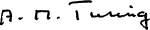

<h2>About Alan Turing </h2> 

<h6>(Father of Modern Computer Science and Artificial Intelligence)</h6>
 
<table>
<tbody>
<tr>
<th scope="row">Born</th>
<td>23 June 1912 

<a title="Maida Vale" href="https://en.wikipedia.org/wiki/Maida_Vale">Maida Vale</a>, London, England

</td>
</tr>
<tr>
<th scope="row">Died</th>
<td>7 June 1954&nbsp;(aged&nbsp;41) 

<a title="Wilmslow" href="https://en.wikipedia.org/wiki/Wilmslow">Wilmslow</a>, Cheshire, England

</td>
</tr>
<tr>
<th scope="row">Cause&nbsp;of death</th>
<td><a title="Cyanide poisoning" href="https://en.wikipedia.org/wiki/Cyanide_poisoning">Cyanide poisoning</a></td>
</tr>
<tr>
<th scope="row">Resting place</th>
<td>Ashes scattered near&nbsp;<a title="Woking Crematorium" href="https://en.wikipedia.org/wiki/Woking_Crematorium">Woking Crematorium</a></td>
</tr>
<tr>
<th scope="row">Residence</th>
<td><a title="Wilmslow" href="https://en.wikipedia.org/wiki/Wilmslow">Wilmslow</a>, Cheshire, England</td>
</tr>
<tr>
<th scope="row">Education</th>
<td><a title="King's College, Cambridge" href="https://en.wikipedia.org/wiki/King%27s_College,_Cambridge">King's College, Cambridge</a>&nbsp;(<a title="Bachelor of Arts" href="https://en.wikipedia.org/wiki/Bachelor_of_Arts">BA</a>,&nbsp;<a title="Master of Arts" href="https://en.wikipedia.org/wiki/Master_of_Arts">MA</a>) <a title="Princeton University" href="https://en.wikipedia.org/wiki/Princeton_University">Princeton University</a>&nbsp;(<a title="Doctor of Philosophy" href="https://en.wikipedia.org/wiki/Doctor_of_Philosophy">PhD</a>)</td>
</tr>
<tr>
<th scope="row">Known&nbsp;for</th>
<td>

<ul>
<li><a title="Cryptanalysis of the Enigma" href="https://en.wikipedia.org/wiki/Cryptanalysis_of_the_Enigma">Cryptanalysis of the Enigma</a></li>
<li><a title="Turing's proof" href="https://en.wikipedia.org/wiki/Turing%27s_proof">Turing's proof</a></li>
<li><a title="Turing machine" href="https://en.wikipedia.org/wiki/Turing_machine">Turing machine</a></li>
<li><a title="Turing test" href="https://en.wikipedia.org/wiki/Turing_test">Turing test</a></li>
<li><a title="Unorganized machine" href="https://en.wikipedia.org/wiki/Unorganized_machine">Unorganised machine</a></li>
<li><a title="LU decomposition" href="https://en.wikipedia.org/wiki/LU_decomposition">LU decomposition</a></li>
</ul>

</td>
</tr>
<tr>
<th scope="row">Awards</th>
<td><a title="Smith's Prize" href="https://en.wikipedia.org/wiki/Smith%27s_Prize">Smith's Prize</a>&nbsp;(1936)</td>
</tr>
<tr>
<td colspan="2"><strong>Scientific career</strong></td>
</tr>
<tr>
<th scope="row">Fields</th>
<td>

<ul>
<li><a title="Logic" href="https://en.wikipedia.org/wiki/Logic">Logic</a></li>
<li><a title="Mathematics" href="https://en.wikipedia.org/wiki/Mathematics">Mathematics</a></li>
<li><a title="Cryptanalysis" href="https://en.wikipedia.org/wiki/Cryptanalysis">Cryptanalysis</a></li>
<li><a title="Computer science" href="https://en.wikipedia.org/wiki/Computer_science">Computer science</a></li>
<li><a title="Mathematical and theoretical biology" href="https://en.wikipedia.org/wiki/Mathematical_and_theoretical_biology">Mathematical and theoretical biology</a></li>
</ul>

</td>
</tr>
<tr>
<th scope="row">Institutions</th>
<td>

<ul>
<li><a title="University of Manchester" href="https://en.wikipedia.org/wiki/University_of_Manchester">University of Manchester</a></li>
<li><a class="mw-redirect" title="Government Code and Cypher School" href="https://en.wikipedia.org/wiki/Government_Code_and_Cypher_School">Government Code and Cypher School</a></li>
<li><a class="mw-redirect" title="National Physical Laboratory, UK" href="https://en.wikipedia.org/wiki/National_Physical_Laboratory,_UK">National Physical Laboratory</a></li>
</ul>

</td>
</tr>
<tr>
<th scope="row"><a title="Thesis" href="https://en.wikipedia.org/wiki/Thesis">Thesis</a></th>
<td><a href="https://github.com/manjunath5496/IIT-JEE-Chemistry-Books/blob/master/t2.pdf" rel="nofollow"><em>Systems of Logic Based on Ordinals</em></a>&nbsp;(1938)</td>
</tr>
<tr>
<th scope="row"><a title="Doctoral advisor" href="https://en.wikipedia.org/wiki/Doctoral_advisor">Doctoral advisor</a></th>
<td><a title="Alonzo Church" href="https://en.wikipedia.org/wiki/Alonzo_Church">Alonzo Church</a></td>
</tr>
<tr>
<th scope="row">Doctoral students</th>
<td><a title="Robin Gandy" href="https://en.wikipedia.org/wiki/Robin_Gandy">Robin Gandy</a></td>
</tr>
<tr>
<th scope="row">Influences</th>
<td><a title="" href="https://en.wikipedia.org/wiki/Max_Newman">Max Newman</a></td>
</tr>
<tr>
<th colspan="2">Signature</th>
</tr>
<tr>
<td style="text-align: center;" colspan="2"> </td>
</tr>
</tbody>
</table>

 

<strong>Further reading </strong>

1.  Computing Machinery and Intelligence By Alan Turing 
              
      <a href="https://github.com/manjunath5496/IIT-JEE-Chemistry-Books/blob/master/t1.pdf" target="_blank" style="text-decoration:none">  
 Download
 </a> 

2.  Systems of Logic Based on Ordinals By Alan Turing  <a href="https://github.com/manjunath5496/IIT-JEE-Chemistry-Books/blob/master/t2.pdf" target="_blank" style="text-decoration:none">  
 Download
 </a> 

3.  The Applications of Probability to Cryptography By Alan Turing  <a href="https://github.com/manjunath5496/IIT-JEE-Chemistry-Books/blob/master/t3.pdf" target="_blank" style="text-decoration:none">  
 Download
 </a> 

4.  Turing's Treatise on the Enigma By Alan Turing  <a href="https://github.com/manjunath5496/IIT-JEE-Chemistry-Books/blob/master/t4.pdf" target="_blank" style="text-decoration:none">  
 Download
 </a> 

5.  The Annotated Turing: A Guided Tour Through Alan Turing's Historic Paper on Computability and the Turing Machine By 
Charles Petzold  <a href="https://github.com/manjunath5496/IIT-JEE-Chemistry-Books/blob/master/t5.pdf" target="_blank" style="text-decoration:none">  
 Download
 </a> 

6.  Turing, Father of the Modern Computer By B. Jack Copeland   <a href="https://github.com/manjunath5496/IIT-JEE-Chemistry-Books/blob/master/t6.pdf" target="_blank" style="text-decoration:none">  
 Download
 </a> 

7.  Alan Turing's Automatic Computing Engine By B. Jack Copeland   <a href="https://github.com/manjunath5496/IIT-JEE-Chemistry-Books/blob/master/t7.pdf" target="_blank" style="text-decoration:none">  
 Download
 </a> 

8.  Alan Turing By Geoff Wilkins   <a href="https://github.com/manjunath5496/IIT-JEE-Chemistry-Books/blob/master/t8.pdf" target="_blank" style="text-decoration:none">  
 Download
 </a> 

9.  Turing Arts Symposium  By Cate Dowd   <a href="https://github.com/manjunath5496/IIT-JEE-Chemistry-Books/blob/master/t9.pdf" target="_blank" style="text-decoration:none">  
 Download
 </a> 

10.  A Bibliography of Publications of Alan Mathison Turing By Nelson H. F. Beebe   <a href="https://github.com/manjunath5496/IIT-JEE-Chemistry-Books/blob/master/t10.pdf" target="_blank" style="text-decoration:none">  
 Download
 </a> 

11.  Alan Turing: His Work and Impact By Jan van Leeuwen   <a href="https://github.com/manjunath5496/IIT-JEE-Chemistry-Books/blob/master/t11.pdf" target="_blank" style="text-decoration:none">  
 Download
 </a> 

12.  The Essential Turing By B. Jack Copeland   <a href="https://github.com/manjunath5496/IIT-JEE-Chemistry-Books/blob/master/t12.pdf" target="_blank" style="text-decoration:none">  
 Download
 </a> 

13.  Mathematics in the Age of the Turing Machine By Thomas C. Hales   <a href="https://github.com/manjunath5496/IIT-JEE-Chemistry-Books/blob/master/t13.pdf" target="_blank" style="text-decoration:none">  
 Download
 </a> 

14.  Letter to Alan Turing By Giuseppe Longo   <a href="https://github.com/manjunath5496/IIT-JEE-Chemistry-Books/blob/master/t14.pdf" target="_blank" style="text-decoration:none">  
 Download
 </a> 

15.  The Legacy of Turing in Numerical Analysis By Felipe Cucker   <a href="https://github.com/manjunath5496/IIT-JEE-Chemistry-Books/blob/master/t15.pdf" target="_blank" style="text-decoration:none">  
 Download
 </a> 

16.  The Turing Test   <a href="https://github.com/manjunath5496/IIT-JEE-Chemistry-Books/blob/master/t16.pdf" target="_blank" style="text-decoration:none">  
 Download
 </a> 

